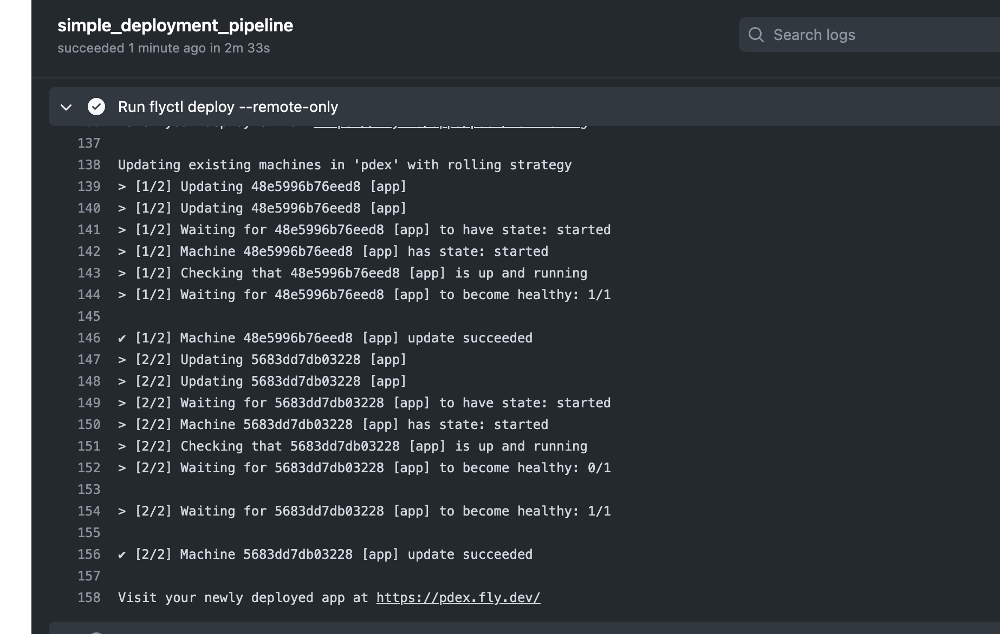
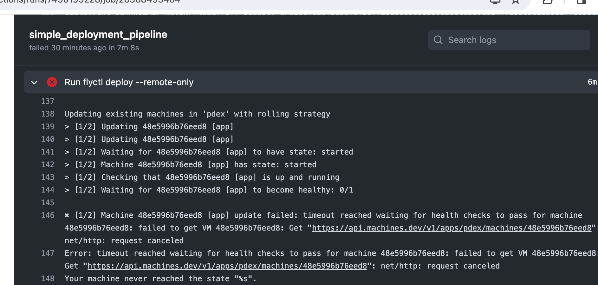

<div class="content">

<!-- Having written a nice application it's time to think about how we're going to deploy it to the use of real users.-->
写了一个不错的应用程序之后，是时候考虑一下如何将它部署到真正的用户中去了。

<!-- In [part 3](/en/part3/deploying_app_to_internet) of this course, we did this by simply running a single command from terminal to get the code up and running the servers of the cloud provider [Fly.io](https://fly.io/) or [Render](hhttps://render.com/).-->
在本课程的[第三章节](/en/part3/deploying_app_to_internet)中，我们只需从终端运行一个单个命令就可以将代码部署到云端提供商[Fly.io](https://fly.io/)或[Render](hhttps://render.com/)的服务器上。

<!-- It is pretty simple to release software in Fly.io and Render at least compared to many other types of hosting setups but it still contains risks: nothing prevents us from accidentally releasing broken code to production.-->
Fly.io 和 Render 至少比起许多其他类型的托管设置来说，发布软件相当简单，但仍然存在风险：没有任何东西可以阻止我们不小心将损坏的代码发布到生产环境中。

<!-- Next, we''re going to look at the principles of making a deployment safely and some of the principles of deploying software on both a small and large scale.-->
接下来，我们将讨论安全部署的原则以及在小规模和大规模部署软件的原则。

### Anything that can go wrong...

<!-- We''d like to define some rules about how our deployment process should work but before that, we have to look at some constraints of reality.-->
我们想定义一些关于我们的部署过程应该如何工作的规则，但在此之前，我们必须先考虑一些现实的约束。

<!-- One on the phrasing of Murphy's Law holds that:-->
**一句关于墨菲定律的表述是：**

如果有可能出错，那么它就一定会出错。
<!--   "Anything that can go wrong will go wrong."-->
「凡事都有可能出错。」

<!-- It's important to remember this when we plan out our deployment system. Some of the things we'll need to consider could include:-->
这在我们计划部署系统时很重要要记住。我们需要考虑的事情可能包括：
<!--  - What if my computer crashes or hangs during deployment?-->
- 如果我的电脑在部署期间崩溃或卡住怎么办？
<!--  - I''m connected to the server and deploying over the internet, what happens if my internet connection dies?-->
- 我已经连接上服务器，正在通过互联网部署，如果我的互联网连接断开了会发生什么？
<!--  - What happens if any specific instruction in my deployment script/system fails?-->
- 如果我的部署脚本/系统中的任何特定指令失败了会发生什么？
<!--  - What happens if, for whatever reason, my software doesn't work as expected on the server I'm deploying to? Can I roll back to a previous version?-->
如果出于某种原因，我的软件在我部署的服务器上无法正常工作，会发生什么？我可以回滚到以前的版本吗？
<!--  - What happens if a user does an HTTP request to our software just before we do deployment (we didn''t have time to send a response to the user)?-->
如果用户在我们部署软件之前就发出了一个HTTP请求（我们没有时间给用户发送响应），会发生什么？

<!-- These are just a small selection of what can go wrong during a deployment, or rather, things that we should plan for. Regardless of what happens, our deployment system should **never** leave our software in a broken state. We should also always know (or be easily able to find out) what state a deployment is in.-->
这只是部署中可能出现的一小部分问题，或者说，我们应该做好计划。无论发生什么，我们的部署系统**永远不应**将软件置于损坏状态。我们也应该始终知道（或者很容易找到）部署的状态。

<!-- Another important rule to remember when it comes to deployments (and CI in general) is:-->
另一个重要的规则，在部署（和一般的持续整合）时要记住的是：
<!--   "Silent failures are **very** bad!"-->
**默默的失败是非常糟糕的！**

<!-- This doesn't mean that failures need to be shown to the users of the software, it means we need to be aware if anything goes wrong. If we are aware of a problem, we can fix it. If the deployment system doesn't give any errors but fails, we may end up in a state where we believe we have fixed a critical bug but the deployment failed, leaving the bug in our production environment and us unaware of the situation.-->
这并不意味着需要向软件用户展示失败，而是我们需要意识到任何出错的情况。如果我们意识到有问题，我们可以修复它。如果部署系统没有任何错误但失败了，我们可能最终会处于一种状态，即我们相信已经修复了一个关键的 bug，但部署失败了，使得 bug 留在我们的生产环境中，而我们不知道这种情况。

### What does a good deployment system do?

<!-- Defining definitive rules or requirements for a deployment system is difficult, let's try anyway:-->
定义一个部署系统的明确规则或要求是很困难的，但我们还是尝试一下：
<!--  - Our deployment system should be able to fail gracefully at **any** step of the deployment.-->
- 我们的部署系统应该能够在部署的**任何**一步优雅地失败。
<!--  - Our deployment system should **never** leave our software in a broken state.-->
- 我们的部署系统**永远不应**使我们的软件处于损坏状态。
<!--  - Our deployment system should let us know when a failure has happened. It's more important to notify about failure than about success.-->
- 我们的部署系统应该让我们知道失败发生时。通知失败比通知成功更重要。
<!--  - Our deployment system should allow us to roll back to a previous deployment-->
- 我们的部署系统应该允许我们回滚到以前的部署。
<!--    - Preferably this rollback should be easier to do and less prone to failure than a full deployment-->
  - 最好这个回滚比完整部署更容易实现，也更不容易出错。
<!--    - Of course, the best option would be an automatic rollback in case of deployment failures-->
  - 当然，最好的选择是在部署失败时自动回滚。
<!--  - Our deployment system should handle the situation where a user makes an HTTP request just before/during a deployment.-->
- 我们的部署系统应该处理用户在部署前/期间发出HTTP请求的情况。
<!--  - Our deployment system should make sure that the software we are deploying meets the requirements we have set for this (e.g. don't deploy if tests haven't been run).-->
- 我们的部署系统应该确保我们部署的软件符合我们为此设定的要求（例如，如果没有运行测试，则不要部署）。

<!-- Let's define some things we **want** in this hypothetical deployment system too:-->
让我们定义一些我们**想要**在这个假设的部署系统中的东西：
<!--  - We would like it to be fast-->
- 我们希望它能快速完成。
<!--  - We''d like to have no downtime during the deployment (this is distinct from the requirement we have for handling user requests just before/during the deployment).-->
- 我们希望在部署期间没有停机时间（这与我们在部署之前/期间处理用户请求的要求是不同的）。

<!-- Next we will have three sets of exercises for automazing the deployment with GitHub Actions, one for [Fly.io](https://fly.io/), another one for [Render](https://render.com/). The process of deployment is always specific to the particular cloud provider, so you can also do the both the exercise sets if you want to see the differences how these services work with respect to deployments.-->
接下来我们将有两组用于用GitHub Actions自动部署的练习，一个是[Fly.io](https://fly.io/)，另一个是[Render](https://render.com/)。部署过程总是特定于特定的云提供商，因此您也可以完成两个练习集，以便查看这些服务在部署方面的差异。


### Has the app been deployed?

<!-- Since we are not making any real changes to the app, it might be a bit hard to see if the app deployment really works. -->
由于我们没有对应用程序进行任何真正的更改，因此可能很难确定应用程序部署是否真的有效。

<!-- Let us create a dummy endpoint in the app that makes it possible to do some code changes and to ensure that the deployed version has really changed: -->
让我们在应用程序中创建一个虚拟端点，这样就可以进行一些代码更改，并确保部署的版本确实发生了变化：

```js
app.get('/version', (req, res) => {
  res.send('1') // change this string to ensure a new version deployed
})
```

</div>

<div class="tasks">

### Exercises 11.10-11.12. (Fly.io)

<!-- If you rather want to use other hosting options, there is an alternative set of exercises for [Render](http://localhost:8000/en/part11/deployment#exercises-11-10-11-12-render).-->
如果您更喜欢使用其他托管选项，[Render](http://localhost:8000/en/part11/deployment#exercises-11-10-11-12-render)有一套替代练习。

#### 11.10 Deploying your application to Fly.io

<!-- Setup your application in [Fly.io](https://fly.io/) hosting service like the one we did in [part 3](/en/part3/deploying_app_to_internet#application-to-the-internet). -->
在 [Fly.io](https://fly.io/) 托管服务中安装应用程序，就像我们在 [part 3](/en/part3/deploying_app_to_internet#application-to-the-internet 所做的那样。）

<!-- In contrast to part 3 now we <i>do not deploy the code</i> to Fly.io ourselves (with the command <i>flyctl deploy</i>), we let the GitHub Actions workflow do that for us!-->
相比起第三章节，我们<i>不再自己部署代码</i>到Fly.io上（使用命令<i>flyctl deploy</i>），我们让GitHub Actions工作流来帮我们完成！

<!-- Before going to the automated deployment, we shall ensure in this exercise that the app can be deployed manually. -->
在进行自动部署之前，我们应确保应用程序可以手动部署。

<!-- So, create a new app in Fly.io. After that generate a Fly.io API token with the command-->
line

在Fly.io上创建一个新的应用，然后使用命令行生成Fly.io API令牌。

```bash
flyctl auth token
```

<!-- You''ll need the token soon for your deployment workflow!-->
你很快就需要令牌来部署工作流程了！

<!-- As said, before setting up the deployment pipeline in the next exercise we will now ensure that a manual deployment with the command <i>flyctl deploy</i> works.-->
在设置部署管道之前，让我们确保使用命令<i>flyctl deploy</i>可以进行手动部署。

<!-- A couple of changes are needed. -->
需要做一些改动。

<!-- The configuration file <i>fly.toml</i> should be modified to include the following: -->
应修改配置文件 <i>fly.toml</i> 以包含以下内容：

```yml
[env]
  PORT = "3000" # add this where PORT matches the internal_port below

[processes]
  app = "node app.js" # add this

[http_service]
  internal_port = 3000
  force_https = true
  auto_stop_machines = true
  auto_start_machines = true
  min_machines_running = 0
  processes = ["app"]
```


### Exercises 11.10-11.12. (Fly.io)

<!-- If you rather want to use other hosting options, there is an alternative set of exercises for [Render](/en/part11/deployment#exercises-11-10-11-12-render). -->
如果你想使用其他托管选项，还有一套 [Render] 的替代练习（/en/part11/deployment#exercises-11-10-11-12-render）。


#### 11.10 Deploying your application to Fly.io

<!-- Setup your application in [Fly.io](https://fly.io/) hosting service like the one we did in [part 3](/en/part3/deploying_app_to_internet#application-to-the-internet). -->
在 [Fly.io](https://fly.io/) 托管服务中安装应用程序，就像我们在 [part 3](/en/part3/deploying_app_to_internet#application-to-the-internet 所做的那样。）

<!-- In contrast to part 3, in this part we <i>do not deploy the code</i> to Fly.io ourselves (with the command <i>flyctl deploy</i>), we let the GitHub Actions workflow do that for us.  -->
与 part3 不同，在这个部分我们 <i>并不直接将代码部署</i> 到 Fly.io (使用命令 <i>flyctl deploy</i>), 我们使用 Github Actions 工作流来为我们做到．

<!-- Before going to the automated deployment, we shall ensure in this exercise that the app can be deployed manually. -->
在进行自动部署之前，我们应确保应用程序可以手动部署。

<!-- So, create a new app in Fly.io. After that generate a Fly.io API token with the command -->
因此，请在 Fly.io 中创建一个新应用程序。然后使用以下命令生成 Fly.io API 令牌

```bash
flyctl auth token
```

<!-- You'll need the token soon for your deployment workflow so save it somewhere (but do not commit that to GitHub)! -->
您很快就会在部署工作流程中用到该令牌，因此请将其保存在某个地方（但不要提交到 GitHub）!

<!-- As said, before setting up the deployment pipeline in the next exercise we will now ensure that a manual deployment with the command <i>flyctl deploy</i> works. -->
如前所述，在下一个练习中设置部署管道之前，我们现在要确保使用 <i>flyctl deploy</i> 命令进行手动部署能够正常运行。

<!-- A couple of changes are needed. -->
需要做一些更改。

<!-- The configuration file <i>fly.toml</i> should be modified to include the following: -->
应修改配置文件 <i>fly.toml</i> 以包含以下内容：

```yml
[env]
  PORT = "3000" # add this where PORT matches the internal_port below

[processes]
  app = "node app.js" # add this

[http_service]
  internal_port = 3000
  force_https = true
  auto_stop_machines = true
  auto_start_machines = true
  min_machines_running = 0
  processes = ["app"]
```

<!-- In [processes](https://fly.io/docs/reference/configuration/#the-processes-section) we define the command that starts the application. Without this change Fly.io just starts the React dev server and that causes it to shut down since the app itself does not start up. We will also set up the PORT to be passed to the app as an environment variable. -->
在 [processes](https://fly.io/docs/reference/configuration/#the-processes-section) 中，我们定义了启动应用程序的命令。如果不做这一更改，Fly.io 只会启动 React dev 服务器，这会导致服务器关闭，因为应用程序本身并没有启动。我们还将把传递给应用程序的端口设置为环境变量。

<!-- We also need to alter the file _.dockerignore_ a bit, the next line should be removed: -->
我们还需要修改一下文件 _.dockerignore_，删除下一行：

```
dist
```

<!-- If the line is not removed, the product build of the frontend does not get downloaded to the Fly.io server. -->
如果不删除该行，前端的产品构建将无法下载到 Fly.io 服务器。

<!-- Deployment should now work _if_ the production build exists in the local machine, that is, the command _npm build_ is run. -->
如果本地计算机中存在生产构建，即运行 _npm build_ 命令后，部署工作就会正常进行。

<!-- Before moving to the next exercise, make sure that the manual deployment with the command <i>flyctl deploy</i> works! -->
在进入下一个练习之前，请确保使用 <i>flyctl deploy</i> 命令进行的手动部署正常运行！

#### 11.11 Automatic deployments

<!-- Extend the workflow with a step to deploy your application to Fly.io by following the advice given [here](https://fly.io/docs/app-guides/continuous-deployment-with-github-actions/). -->
按照 [此处](https://fly.io/docs/app-guides/continuous-deployment-with-github-actions/)给出的建议，扩展工作流程，添加将应用程序部署到 Fly.io 的步骤。

<!-- Note that the GitHub Action should create the production build (with _npm run build_) before the deployment step! -->
请注意，GitHub 操作应在部署步骤之前创建生产构建（使用 _npm run build_）！

<!-- You need the authorization token that you just created for the deployment. The proper way to pass it's value to GitHub Actions is to use _Repository secrets_: -->
部署时需要刚才创建的授权令牌。将其值传递给 GitHub 操作的正确方法是使用 _Repository secrets_：


Now the workflow can access the token value as follows:
现在，工作流可以如下方式访问令牌值：

```
${{secrets.FLY_API_TOKEN}}
```

If all goes well, your workflow log should look a bit like this:
如果一切顺利，你的工作流程日志应该是这样的：



<!-- **Remember** that it is always essential to keep an eye on what is happening in server logs when playing around with product deployments, so use <code>flyctl logs</code> early and use it often. No, use it all the time! -->
**请记住***，在玩转产品部署时，始终关注服务器日志中发生的情况至关重要，因此请尽早并经常使用 <code>flyctl logs</code>。不，是一直使用！

#### 11.12 Health check

<!-- Each deployment in Fly.io creates a [release](https://fly.io/docs/flyctl/releases/). Releases can be checked from the command line: -->
Fly.io 中的每次部署都会创建一个 [release](https://fly.io/docs/flyctl/releases/)。可通过命令行检查发布情况：

```bash
$ flyctl releases
VERSION	STATUS  	DESCRIPTION	USER           	DATE
v18    	complete	Release    	mluukkai@iki.fi	16h56m ago
v17    	complete	Release    	mluukkai@iki.fi	17h3m ago
v16    	complete	Release    	mluukkai@iki.fi	21h22m ago
v15    	complete	Release    	mluukkai@iki.fi	21h25m ago
v14    	complete	Release    	mluukkai@iki.fi	21h34m ago
```

It is essential to ensure that a deployment ends up in a <i>succeeding</i> release, where the app is in healthy functional state. Fortunately, Fly.io has several configuration options that take care of the application health check.
确保部署以<i>成功</i>的版本结束，应用程序处于健康的功能状态，这一点至关重要。幸运的是，Fly.io 提供了多个配置选项来进行应用程序健康检查。

If we change the app as follows, it fails to start:
如果我们对应用程序进行如下更改，它就无法启动：

```js
app.listen(PORT, () => {
  this_causes_error
  // eslint-disable-next-line no-console
  console.log(`server started on port ${PORT}`)
})
```

In this case, the deployment fails:
在这种情况下，部署会失败：

```bash
$ flyctl releases
VERSION	STATUS  	DESCRIPTION	USER           	DATE
v19    	failed  	Release    	mluukkai@iki.fi	3m52s ago
v18    	complete	Release    	mluukkai@iki.fi	16h56m ago
v17    	complete	Release    	mluukkai@iki.fi	17h3m ago
v16    	complete	Release    	mluukkai@iki.fi	21h22m ago
v15    	complete	Release    	mluukkai@iki.fi	21h25m ago
v14    	complete	Release    	mluukkai@iki.fi	21h34m ago
```

The app however stays up and running, Fly.io does not replace the functioning version  (v18) with the broken one (v19).
但是，应用程序仍在运行，Fly.io 不会用损坏的版本（v19）替换正常运行的版本（v18）。

Let us consider the following change
让我们考虑以下变化

```js
// start app in a wrong port
app.listen(PORT + 1, () => {
  // eslint-disable-next-line no-console
  console.log(`server started on port ${PORT}`)
})
```

<!-- Now the app starts but it is connected to the wrong port, so the service will not be functional. Fly.io thinks this is a successful deployment, so it deploys the app in a broken state. -->
现在，应用程序启动了，但它连接到了错误的端口，因此服务将无法运行。Fly.io 认为这是一次成功的部署，因此会在中断状态下部署应用程序。

<!-- One possibility to prevent broken deployments is to use an HTTP-level check defined in section [http\_service.http_checks](https://fly.io/docs/reference/configuration/#http_service-checks). This type of check can be used to ensure that the app for real is in a functional state.  -->
防止部署中断的一种方法是使用 [http\_service.http_checks](https://fly.io/docs/reference/configuration/#http_service-checks) 节中定义的 HTTP 级检查。这种类型的检查可用于确保应用程序处于正常运行状态。

<!-- Add a simple endpoint for doing an application health check to the backend. You may e.g. copy this code: -->
添加一个简单的端点，用于对后台应用程序进行健康检查。例如，您可以复制这段代码：

```js
app.get('/health', (req, res) => {
  res.send('ok')
})
```

<!-- Configure then an [HTTP check](https://fly.io/docs/reference/configuration/#http_service-checks) that ensures the health of the deployments based on the HTTP request to the defined health check endpoint. -->
然后配置 [HTTP check](https://fly.io/docs/reference/configuration/#http_service-checks)，根据向定义的健康检查端点发出的 HTTP 请求确保部署的健康状况。

<!-- You also need to set the [deployment strategy](https://fly.io/docs/reference/configuration/#picking-a-deployment-strategy) (in the file _fly.toml_) of the app to be <i>canary</i>. These strategies ensure that only an app with a healthy state gets deployed. -->
您还需要将应用程序的 [部署策略](https://fly.io/docs/reference/configuration/#picking-a-deployment-strategy)（在文件 _fly.toml_中）设置为<i>canary</i>。这些策略可确保只部署状态健康的应用程序。

<!-- Ensure that GitHub Actions notices if a deployment breaks your application: -->
确保 GitHub Actions 在部署破坏应用程序时发出通知：



You may simulate this e.g. as follows:
例如，您可以按以下方式进行模拟：

```js
app.get('/health', (req, res) => {
  // eslint-disable-next-line no-constant-condition
  if (true) throw('error...  ')
  res.send('ok')
})
```

</div>

<div class="tasks">

### Exercises 11.10-11.12. (Render)

<!-- If you rather want to use other hosting options, there is an alternative set of exercises for [Fly.io](/en/part11/deployment/#exercises-11-10-11-12-fly-io). -->
如果你想使用其他托管选项，还有一套适用于 [Fly.io] 的练习（/en/part11/deployment/#exercises-11-10-11-12-fly-io）。

#### 11.10 Deploying your application to Render

<!-- Set up your application in [Render](https://render.com/). The setup is now not quite as straightforward as in [part 3](/en/part3/deploying_app_to_internet#application-to-the-internet). You have to carefully think about what should go to these settings: -->
在 [Render](https://render.com/) 中设置应用程序。现在的设置不像 [part 3](/en/part3/deploying_app_to_internet#application-to-the-internet)那么简单。您必须仔细考虑这些设置中应包含哪些内容：


<!-- If you need to run several commands in the build or start command, you may use a simple shell script for that. -->
如果需要在构建或启动命令中运行多个命令，可以使用简单的 shell 脚本。

<!-- Create eg. a file <i>build_step.sh</i> with the following content: -->
例如，创建一个 <i>build_step.sh</i> 文件，内容如下：

```bash
#!/bin/bash

echo "Build script"

# add the commands here
```

<!-- Give it execution permissions (Google or see e.g. [this](https://www.guru99.com/file-permissions.html) to find out how) and ensure that you can run it from the command line: -->
赋予它执行权限（Google 或参阅 [this](https://www.guru99.com/file-permissions.html) 了解方法），并确保可以从命令行运行它：

```bash
$ ./build_step.sh
Build script
```

<!-- Other option is to use a [Pre deploy command](https://docs.render.com/deploys#deploy-steps), with that you may run one additional command before the deployment starts. -->
另一种方法是使用 [预部署命令](https://docs.render.com/deploys#deploy-steps)，这样就可以在部署开始前运行一个额外的命令。

<!-- You also need to open the <i>Advanced settings</i> and turn the auto-deploy off since we want to control the deployment in the GitHub Actions: -->
您还需要打开<i>高级设置</i>并关闭自动部署，因为我们希望在 GitHub 操作中控制部署：


<!-- Ensure now that you get the app up and running. Use the <i>Manual deploy</i>. -->
确保现在应用程序正常运行．使用<i>手工部署</i>

<!-- Most likely things will fail at the start, so remember to keep the <i>Logs</i> open all the time. -->
很可能一开始就出现故障，因此请记住始终打开<i>日志</i>。

#### 11.11 Automatic deployments

<!-- Next step is to automate the deployment. There are two options, a ready-made custom action or the use of the Render deploy hook. -->
下一步是自动部署。有两种选择，一种是现成的自定义操作，另一种是使用渲染部署钩子。

<strong>Deployment with custom action</strong>

Go to GitHub Actions [marketplace](https://github.com/marketplace) and search for action for our purposes. You might search with <i>render deploy</i>. There are several actions to choose from. You can pick any. Quite often the best choice is the one with the most stars. It is also a good idea to look if the action is actively maintained (time of the last release) and does it have many open issues or pull requests. 

**Warning**: for some reason, the most starred option [render-action](https://github.com/Bounceapp/render-action) was very unreliable when the part was updated (16th Jan 2024), so better avoid that. If you end up with too much problems, the deploy hook might be a better option!

Set up the action to your workflow and ensure that every commit that passes all the checks results in a new deployment. Note that you need Render API key and the app service id for the deployment. See [here](https://render.com/docs/api) how the API key is generated. You can get the service id from the URL of the Render dashboard of your app. The end of the URL (starting with _srv-_) is the id:

```bash
https://dashboard.render.com/web/srv-randomcharachtershere
```

<strong>Deployment with deploy hook</strong>

Alternative, and perhaps a more reliable option is to use [Render Deploy Hook](https://render.com/docs/deploy-hooks) which is a private URL to trigger the deployment. You can get it from your app settings:


DON'T USE the plain URL in your pipeline. Instead create GitHub secrets for your key and service id: 
Then you can use them like this: 
``` bash
- name: Trigger deployment
  run: curl https://api.render.com/deploy/srv-${{ secrets.RENDER_SERVICE_ID }}?key=${{ secrets.RENDER_API_KEY }}
```

The deployment takes some time. See the events tab of the Render dashboard to see when the new deployment is ready:


#### 11.12 Health check

All tests pass and the new version of the app gets automatically deployed to Render so everything seems to be in order. But does the app really work? Besides the checks done in the deployment pipeline, it is extremely beneficial to have also some "application level" health checks ensuring that the app for real is in a functional state.

The [zero downtime deploys](https://docs.render.com/deploys#zero-downtime-deploys) in Render should ensure that your app stays functional all the time! For some reason, this property did not always work as promised when this part was updated (16th Jan 2024). The reason might be the use of a free account.

Add a simple endpoint for doing an application health check to the backend. You may e.g. copy this code:

```js
app.get('/health', (req, res) => {
  res.send('ok')
})
```

Commit the code and push it to GitHub. Ensure that you can access the health check endpoint of your app.

Configure now a <i>Health Check Path</i> to your app. The configuration is done in the settings tab of the Render dashboard.

Make a change in your code, push it to GitHub, and ensure that the deployment succeeds.

Note that you can see the log of deployment by clicking the most recent deployment in the events tab.

When you are set up with the health check, simulate a broken deployment by changing the code as follows:

```js
app.get('/health', (req, res) => {
  // eslint-disable-next-line no-constant-condition
  if (true) throw('error...  ')
  res.send('ok')
})
```

Push the code to GitHub and ensure that a broken version does not get deployed and the previous version of the app keeps running.

Before moving on, fix your deployment and ensure that the application works again as intended.

</div>