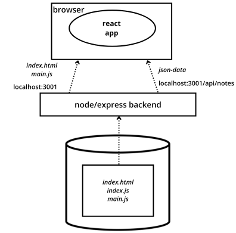
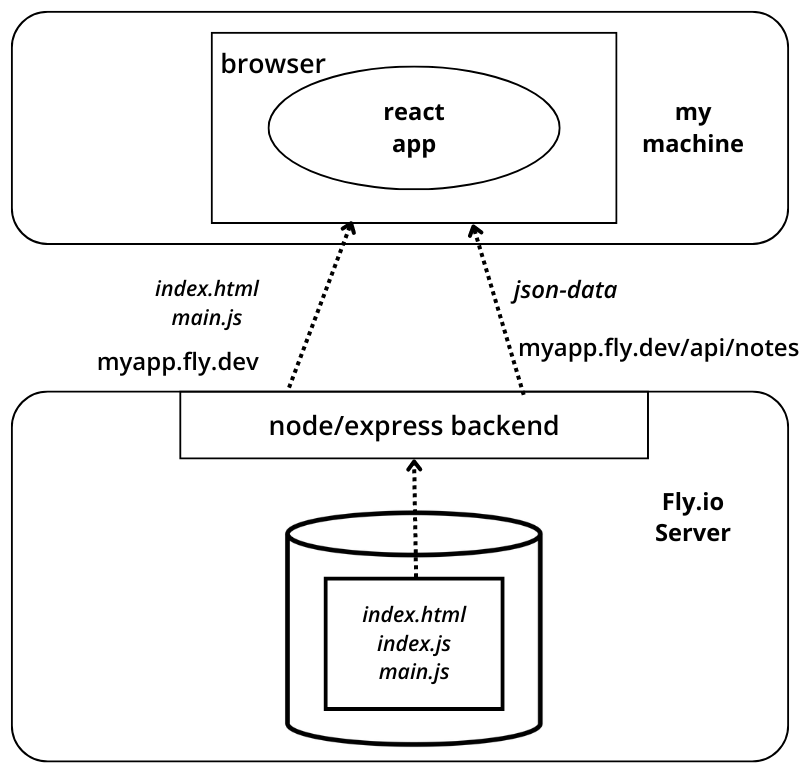

<div class="content">

<!-- Next let's connect the frontend we made in [part 2](/en/part2) to our own backend.-->
 接下来让我们把我们在[第二章节](/zh/part2)中制作的前端连接到我们自己的后端。

<!-- In the previous part, the frontend could ask for the list of notes from the json-server we had as a backend, from the address http://localhost:3001/notes.-->
 在上一部分中，前端可以从我们作为后端的json-server中询问笔记列表，地址是http://localhost:3001/notes 。
<!-- Our backend has a slightly different url structure now, as the notes can be found at http://localhost:3001/api/notes. Let's change the attribute __baseUrl__ in the <i>src/services/notes.js</i> like so:-->
 我们的后端现在有一个稍微不同的url结构，因为笔记可以在http://localhost:3001/api/notes 。让我们改变<i>src/services/notes.js</i>中的属性__baseUrl__，像这样。

```js
import axios from 'axios'
const baseUrl = 'http://localhost:3001/api/notes' //highlight-line

const getAll = () => {
  const request = axios.get(baseUrl)
  return request.then(response => response.data)
}

// ...

export default { getAll, create, update }
```

<!-- Now frontend's GET request to <http://localhost:3001/api/notes> does not work for some reason:-->
 现在到 <http://localhost:3001/api/notes> 前端的GET请求由于某些原因不能工作。


<!-- What's going on here? We can access the backend from a browser and from postman without any problems.-->
这里发生了什么？我们可以从浏览器和Postman访问后端而不会出现任何问题。

### Same origin policy and CORS

<!-- The issue lies with a thing called _same origin policy_. A URL's origin is defined by the combination of protocol (AKA scheme), hostname, and port.-->
问题在于一个叫做_同源策略_的东西。URL的源由协议（又称为方案）、主机名和端口组合而定。

```text
http://example.com:80/index.html

protocol: http
host: example.com
port: 80
```

<!-- When you visit a website (i.e <http://catwebsites.com>), the browser issues a request to the server on which the website (catwebsites.com) is hosted. The response sent by the server is an HTML file that may contain one or more references to external assets/resources hosted either on the same server that <i>catwebsites.com</i> is hosted on or a different website. When the browser sees reference(s) to a URL in the source HTML, it issues a request. If the request is issued using the URL that the source HTML was fetched from, then the browser processes the response without any issues. However, if the resource is fetched using a URL that doesn''t share the same origin(scheme, host, port) as the source HTML, the browser will have to check the _Access-Control-Allow-origin_ response header. If it contains _*_ or the URL of the source HTML, the browser will process the response, otherwise the browser will refuse to process it and throw an error.-->
当您访问网站（例如<http://catwebsites.com>）时，浏览器会向托管该网站（catwebsites.com）的服务器发出请求。服务器发送的响应是一个HTML文件，可能包含一个或多个指向托管在与<i>catwebsites.com</i>相同服务器上的外部资源/资源的引用，或者是不同的网站。当浏览器看到源HTML中的URL引用时，它会发出请求。如果请求是使用从源HTML获取的URL发出的，那么浏览器就可以正常处理响应。但是，如果使用与源HTML不共享相同源（方案，主机，端口）的URL获取资源，则浏览器将必须检查_Access-Control-Allow-origin_响应头。如果它包含_*_或源HTML的URL，浏览器将处理响应，否则浏览器将拒绝处理它并抛出错误。

<!-- The <strong>same-origin policy</strong> is a security mechanism implemented by browsers in order to prevent session hijacking among other security vulnerabilities.-->
<strong>同源策略</strong>是浏览器实施的一种安全机制，以防止会话劫持和其他安全漏洞。

<!-- In order to enable legitimate cross-origin requests (requests to URLs that don''t share the same origin) W3C came up with a mechanism called <strong>CORS</strong>(Cross-Origin Resource Sharing). According to [Wikipedia](https://en.wikipedia.org/wiki/Cross-origin_resource_sharing):-->
为了使合法的跨源请求（请求不共享相同源的URL）成为可能，W3C提出了一种称为<strong>CORS（跨源资源共享）</strong>的机制。根据[维基百科](https://en.wikipedia.org/wiki/Cross-origin_resource_sharing)：

<!-- > <i>Cross-origin resource sharing (CORS) is a mechanism that allows restricted resources (e.g. fonts) on a web page to be requested from another domain outside the domain from which the first resource was served. A web page may freely embed cross-origin images, stylesheets, scripts, iframes, and videos. Certain "cross-domain" requests, notably Ajax requests, are forbidden by default by the same-origin security policy.</i>-->
> <i>跨域资源共享（CORS）是一种机制，允许从另一个域外的域请求受限资源（例如字体），而这些资源是从第一个资源服务器提供的。一个网页可以自由地嵌入跨域图像、样式表、脚本、iframe和视频。由于同源安全策略，默认情况下禁止某些“跨域”请求，特别是Ajax请求。</i>

<!-- The problem is that, by default, the JavaScript code of an application that runs in a browser can only communicate with a server in the same [origin](https://developer.mozilla.org/en-US/docs/Web/Security/Same-origin_policy).-->
问题是，默认情况下，在浏览器中运行的应用程序的JavaScript代码只能与[同源](https://developer.mozilla.org/en-US/docs/Web/Security/Same-origin_policy)的服务器进行通信。
<!-- Because our server is in localhost port 3001, while our frontend is in localhost port 3000, they do not have the same origin.-->
因为我们的服务器在本地主机端口3001，而我们的前端在本地主机端口3000，它们没有相同的源。

<!-- Keep in mind, that [same-origin policy](https://developer.mozilla.org/en-US/docs/Web/Security/Same-origin_policy) and CORS are not specific to React or Node. They are universal principles regarding the safe operation of web applications.-->
请记住，[同源策略](https://developer.mozilla.org/en-US/docs/Web/Security/Same-origin_policy)和CORS不是React或Node的特定内容。它们是关于网络应用安全操作的普遍原则。

<!-- We can allow requests from other <i>origins</i> by using Node's [cors](https://github.com/expressjs/cors) middleware.-->
我们可以通过使用Node的[cors](https://github.com/expressjs/cors)中间件来允许来自其他<i>源</i>的请求。

<!-- In your backend repository, install <i>cors</i> with the command-->
在你的后端仓库中，使用命令安装<i>cors</i>：

```bash
npm install cors
```

<!-- take the middleware to use and allow for requests from all origins:-->
使用中间件，允许来自所有来源的请求：

```js
const cors = require('cors')

app.use(cors())
```

<!-- **Note:** When you are enabling cors, you should think about how you want to configure it. In the case of our application, since the backend is not expected to be visible to the public in the production environment, it may make more sense to only enable cors from a specific origin (e.g. the front end).  -->
**注：** 启用 cors 时，应考虑如何配置。就我们的应用程序而言，由于后端在生产环境中不会对公众可见，因此只从特定来源（如前端）启用 cors 可能更有意义。

<!-- Now most of the features in the frontend work! The functionality for changing the importance of notes has not yet been implemented on the backend so naturally that does not yet work in the frontend. We shall fix that later. -->
现在，前端的大部分功能都能正常工作了！更改备注重要性的功能尚未在后台实现，因此自然也无法在前台使用。我们稍后会解决这个问题。

<!-- You can read more about CORS from [Mozilla's page](https://developer.mozilla.org/en-US/docs/Web/HTTP/CORS).-->
你可以在[Mozilla 的页面](https://developer.mozilla.org/en-US/docs/Web/HTTP/CORS)上了解更多关于 CORS 的信息。

<!-- The setup of our app looks now as follows:-->
我们的应用程序的设置现在如下：


<!-- The react app running in the browser now fetches the data from node/express-server that runs in localhost:3001.-->
React应用现在在浏览器中运行，从运行在localhost:3001上的node/express-server获取数据。

### Application to the Internet

<!-- Now that the whole stack is ready, let's move our application to the internet.-->
现在整个堆栈已经准备就绪，让我们把我们的应用程序移动到互联网上吧。

<!-- There are an ever-growing number of services that can be used to host an app on the internet. The developer-friendly services like PaaS (i.e. Platform as a Service) take care of installing the execution environment (eg. Node.js) and could also provide various services such as databases.-->
有越来越多的服务可以用来在互联网上托管应用程序。开发者友好的服务，如PaaS（即平台即服务）负责安装执行环境（例如Node.js），并可提供各种服务，如数据库。

<!-- For a decade, [Heroku](http://heroku.com) was dominating the PaaS scene. Unfortunately the free tier Heroku ended at 27th November 2022. This is very unfortunate for many developers, especially students. Heroku is still very much a viable option if you are willing to spend some money. They also have [a student program](https://www.heroku.com/students) that provides some free credits.-->
近十年来，[Heroku](http://heroku.com) 一直在PaaS（平台即服务）领域占据着主导地位。不幸的是，Heroku的免费版本将于2022年11月27日终止。这对许多开发人员，尤其是学生来说是非常不幸的。如果你愿意花点钱，Heroku仍然是一个可行的选择。他们还有[一个学生计划](https://www.heroku.com/students)，提供一些免费的学分。

<!-- We are now introducing two services [Fly.io](https://fly.io/) and [Render](https://render.com/) that both have a (limited) free plan. Fly.io is our "official" hosting service since it can be for sure used also on the parts 11 and 13 of the course. Render will be fine at least for the other parts of this course.-->
我们现在介绍两项服务[Fly.io](https://fly.io/)和[Render](https://render.com/)，它们都有一个（有限的）免费计划。Fly.io是我们的“官方”托管服务，因为它可以确保在本课程的第11和13部分中使用。Render至少可以用于本课程的其他部分。

<!-- Note that despite using the free tier only, Fly.io <i>might</i> require one to enter the credit card details. At the moment Render can be used without a credit card.-->
注意，尽管只使用免费版，Fly.io <i>可能</i> 需要输入信用卡详细信息。目前，Render 可以不使用信用卡。

<!-- Render might be a bit easier to use since it does not require any software to be installed on your machine.-->
可能使用Render会更容易，因为它不需要在您的计算机上安装任何软件。

<!-- There are also some other free options hosting options that work well for this course, at least for all parts other than part 11 (CI/CD) that might have one tricky exercise for other platforms.-->
也有一些其他免费的托管选项可以很好地用于本课程，至少除了第11部分（CI/CD）可能会有一个棘手的练习外，其他部分都可以。

<!-- Some course participants have also used the following services: -->
一些课程参与者还使用了以下服务：

<!-- - [Cyclic](https://www.cyclic.sh/)-->
[Cyclic](https://www.cyclic.sh/)
<!-- - [Replit](https://replit.com)-->
- [Replit](https://replit.com)
<!-- - [CodeSandBox](https://codesandbox.io)-->
- [CodeSandBox](https://codesandbox.io)

<!-- If you know some other good and easy-to-use services for hosting NodeJS, please let us know!-->
如果你知道其他一些好用且易于使用的NodeJS托管服务，请告诉我们！

<!-- For both Fly.io and Render, we need to change the definition of the port our application uses at the bottom of the <i>index.js</i> file like so:-->
在`index.js`文件的底部，我们需要更改Fly.io和Render的端口定义，如下所示：

```js
const PORT = process.env.PORT || 3001  // highlight-line
app.listen(PORT, () => {
  console.log(`Server running on port ${PORT}`)
})
```

<!-- Now we are using the port defined in the [environment variable](https://en.wikipedia.org/wiki/Environment_variable) _PORT_ or port 3001 if the environment variable _PORT_ is undefined. Fly.io and Render configure the application port based on that environment variable.-->
现在我们正在使用[环境变量](https://en.wikipedia.org/wiki/Environment_variable)_PORT_中定义的端口，如果_PORT_环境变量未定义，则使用端口3001。Fly.io和Render将基于该环境变量配置应用程序端口。

#### Fly.io

<!-- <i>Note that you may need to give your credit card number to Fly.io even if you are using only the free tier!</i> There has been actually conflicting reports about this, it is known for a fact that some of the students in this course are using Fly.io without entering the credit card info. At the moment [Render](https://render.com/) can be used without a credit card. -->
<i>请注意，即使您只使用免费层，您也可能需要向 Fly.io 提供您的信用卡号！</i>关于这一点的报道实际上是相互矛盾的，本课程的一些学生在使用 Fly.io 时没有输入信用卡信息。目前，[render](https://render.com/) 无需信用卡即可使用。

<!-- By default, everyone gets two free virtual machines that can be used for running two apps at the same time.-->
默认情况下，每个人都可以免费获得两台虚拟机，可以同时运行两个应用程序。

<!-- If you decide to use [Fly.io](https://fly.io/) begin by installing their flyctl executable following [this guide](https://fly.io/docs/hands-on/install-flyctl/). After that, you should [create a Fly.io account](https://fly.io/docs/hands-on/sign-up/).-->
如果您决定使用[Fly.io](https://fly.io/)，请按照[此指南](https://fly.io/docs/hands-on/install-flyctl/)开始安装它们的flyctl可执行文件。之后，您应该[创建一个Fly.io帐户](https://fly.io/docs/hands-on/sign-up/)。

<!-- Start by [authenticating](https://fly.io/docs/hands-on/sign-in/) via the command line with the command-->
:

开始通过命令行[认证](https://fly.io/docs/hands-on/sign-in/)，使用以下命令：

```bash
fly auth login
```

<!-- *Note* if the command _fly_ does not work on your machine, you can try the longer version _flyctl_. Eg. on MacOS, both forms of the command work.-->
如果你的机器上的 _fly_ 命令不起作用，你可以尝试更长的版本 _flyctl_。例如，在MacOS上，两种形式的命令都能正常工作。

<i>If you do not get the flyctl to work in your machine, you could try Render (see next section), it does not require anything to be installed in your machine.</i>

<!-- Initializing an app happens by running the following command in the root directory of the app-->
在应用程序的根目录中运行以下命令可以初始化应用程序：

```bash
fly launch --no-deploy
```

<!-- Give the app a name or let Fly.io auto-generate one. Pick a region where the app will be run. Do not create a Postgres database for the app and do not create an Upstash Redis database, since these are not needed.-->
给应用程序取一个名字，或者让Fly.io自动生成一个。选择一个运行应用程序的区域。不要为应用程序创建Postgres数据库，也不要创建Upstash Redis数据库，因为这些都不需要。

<!-- Fly.io creates a file <i>fly.toml</i> in the root of your app where the app is configured. To get the app up and running we <i>might</i> need to do a small addition to the part [env] of the configuration:-->
Fly.io 在您的应用程序的根目录中创建一个文件<i>fly.toml</i>，其中配置了应用程序。 为了让应用程序正常运行，我们<i>可能</i>需要在配置的[env]部分做一些小的添加：

```bash
[build]

[env]
  PORT = "3000" # add this

[http_service]
  internal_port = 3000 # ensure that this is same as PORT
  force_https = true
  auto_stop_machines = true
  auto_start_machines = true
  min_machines_running = 0
  processes = ["app"]
```

<!-- We have now defined in the part [env] that environment variable PORT will get the correct port (defined in part [services]) where the app should create the server. Note that the definition might be already there, but some times it has been missing.-->
我们现在已在[env]部分定义环境变量PORT将获得正确的端口（在[services]部分定义），应用程序应在其中创建服务器。请注意，定义可能已经存在，但有时可能会缺失。

<!-- We are now ready to deploy the app to the Fly.io servers. That is done with the following command:-->
我们现在准备将应用部署到Fly.io服务器。这可以通过以下命令完成：

```bash
fly deploy
```

<!-- If all goes well, the app should now be up and running. You can open it in the browser with the command-->
`python app.py`

如果一切顺利，应用程序现在应该已经启动并运行了。你可以用 `python app.py` 命令在浏览器中打开它。

```bash
fly apps open
```

<!-- A particularly important command is _fly logs_. This command can be used to view server logs. It is best to keep logs always visible!-->
_fly logs_ 是一个特别重要的命令。这个命令可以用来查看服务器日志。最好总是保持日志可见！

<!-- **Note:** Fly may create 2 machines for your app, if it does then the state of the data in your app will be inconsistent between requests, i.e. you would have two machines each with its own notes variable, you could POST to one machine then your next GET could go to another machine. You can check the number of machines by using the command "$ fly scale show", if the COUNT is greater than 1 then you can enforce it to be 1 with the command "$ fly scale count 1". The machine count can also be checked on the dashboard. -->
**注意：** Fly 可能会为您的应用程序创建 2 台机器，如果创建了 2 台机器，您应用程序中的数据状态在不同请求之间就会不一致，也就是说，您会有 2 台机器，每台机器都有自己的备注变量，您可以 POST 到一台机器，然后下一次 GET 可能会转到另一台机器。你可以使用“$ fly scale show ”命令来检查机器数量，如果 COUNT 大于 1，你可以使用“$ fly scale count 1 ”命令将其强制为 1。也可以在 dashboard 上检查机器数量。

<!-- **Note:** In some cases (the cause is so far unknown) running Fly.io commands especially on Windows WSL has caused problems. If the following command just hangs-->
and does not produce any output, please try running it again with `--no-progress` added.

**注意：** 在某些情况下（原因尚不清楚），运行Fly.io命令尤其是在Windows WSL上会出现问题。如果以下命令只是挂起，而不产生任何输出，请尝试在其后添加`--no-progress`再次运行。

```bash
flyctl ping -o personal
```

<!-- your computer can not for some reason connect to Fly.io. If this happens to you, [this](https://github.com/fullstack-hy2020/misc/blob/master/fly_io_problem.md) describes one possible way to proceed.-->
如果你的电脑出现无法连接Fly.io的情况，[这里](https://github.com/fullstack-hy2020/misc/blob/master/fly_io_problem.md)描述了可以尝试的一种方法。

<!-- If the output of the below command looks like this:-->
如果以下命令的输出看起来像这样：

```bash
$ flyctl ping -o personal
35 bytes from fdaa:0:8a3d::3 (gateway), seq=0 time=65.1ms
35 bytes from fdaa:0:8a3d::3 (gateway), seq=1 time=28.5ms
35 bytes from fdaa:0:8a3d::3 (gateway), seq=2 time=29.3ms
...
```

<!-- then there are no connection problems!-->
如果没有连接问题，那就太好了！

<!-- Whenever you make changes to the application, you can take the new version to production with a command -->
每次对应用程序进行更改，都可以使用如下命令将新版本带入生产环境

```bash
fly deploy
```

#### Render

<!-- The following assumes that the [sign in](https://dashboard.render.com/) has been made with a GitHub account.-->
以下假设[登录](https://dashboard.render.com/)是用GitHub账户完成的。

<!-- After signing in, let us create a new "web service":-->
登录后，让我们创建一个新的“网络服务”：


<!-- The app repository is then connected to Render:-->
应用程序仓库然后连接到Render：


<!-- The connecting seem to require that the app repository is public.-->
连接似乎需要应用存储库是公开的。

<!-- Next we will define the basic configurations. If the app is <i>not</i> at the root of the repository the <i>Root directory</i> needs to be given a proper value:-->
接下来我们将定义基本配置。如果应用程序<i>不是</i>存储库的根目录，<i>根目录</i>需要给予适当的值：


<!-- After this, the app starts up in the Render. The dashboard tells us the app state and the url where the app is running:-->
之后，应用程序在Render中启动。仪表板告诉我们应用程序的状态以及应用程序正在运行的url：


<!-- According to the [documentation](https://render.com/docs/deploys) every commit to GitHub should redeploy the app. For some reason this is not always working.-->
根据[文档](https://render.com/docs/deploys)，每次提交到GitHub都应该重新部署应用程序。由于某些原因，这并不总是有效的。

<!-- Fortunately it is also possible to manually redeploy the app:-->
幸运的是，也可以手动重新部署应用程序：


<!-- Also the app logs can be seen in the dashboard:-->
也可以在仪表盘中查看应用程序日志：


<!-- We notice now from the logs that the app has been started in the port 10000. The app code gets the right port through the environment variable PORT so it is essential that the file <i>index.js</i> has been updated as follows:-->
我们从日志中注意到，应用程序已在端口10000启动。应用程序代码通过环境变量PORT获取正确的端口，因此必须更新<i>index.js</i>文件，如下所示：

```js
const PORT = process.env.PORT || 3001  // highlight-line
app.listen(PORT, () => {
  console.log(`Server running on port ${PORT}`)
})
```

### Frontend production build

<!-- So far we have been running React code in <i>development mode</i>. In development mode the application is configured to give clear error messages, immediately render code changes to the browser, and so on.-->
到目前为止，我们一直在<i>开发模式</i>中运行React代码。在开发模式下，应用程序被配置为提供清晰的错误消息，立即将代码更改渲染到浏览器中，等等。

<!-- When the application is deployed, we must create a [production build](https://reactjs.org/docs/optimizing-performance.html#use-the-production-build) or a version of the application which is optimized for production.-->
当应用程序部署时，我们必须创建[生产构建](https://reactjs.org/docs/optimizing-performance.html#use-the-production-build)或优化用于生产的应用程序的版本。

<!-- A production build of applications created with <i>create-react-app</i> can be created with the command [npm run build](https://vitejs.dev/guide/build.html).-->
使用<i>create-react-app</i>创建的应用程序的生产构建可以使用命令[npm run build](https://vitejs.dev/guide/build.html)创建。

<!-- Let's run this command from the <i>root of the notes frontend project</i> that we developed in [Part 2](/en/part2). -->
让我们在 [第 2 章节](/en/part2) 中开发的<i>笔记前端项目的根目录</i>中运行这条命令。

<!-- This creates a directory called <i>dist</i> which contains the only HTML file of our application (<i>index.html</i>) and the directory <i>assets</i>. [Minified](<https://en.wikipedia.org/wiki/Minification_(programming)>) version of our application's JavaScript code will be generated in the <i>dist</i> directory. Even though the application code is in multiple files, all of the JavaScript will be minified into one file. All of the code from all of the application's dependencies will also be minified into this single file. -->
这将创建一个叫做<i>dist</i>的目录（其中包含我们应用程序的唯一的HTML文件<i>index.html</i>）和目录<i>assets</i>。我们应用程序的JavaScript代码的[最小化](<https://en.wikipedia.org/wiki/Minification_(programming)>)版本将被生成在<i>dist</i>目录中。尽管应用程序代码分布在多个文件中，但所有的JavaScript代码都将被最小化到一个文件中。所有来自应用程序依赖的代码也将被最小化到这个单一文件中。

<!-- The minified code is not very readable. The beginning of the code looks like this:-->
最小化的代码不是很容易阅读。代码的开头看起来像这样：

```js
!function(e){function r(r){for(var n,f,i=r[0],l=r[1],a=r[2],c=0,s=[];c<i.length;c++)f=i[c],o[f]&&s.push(o[f][0]),o[f]=0;for(n in l)Object.prototype.hasOwnProperty.call(l,n)&&(e[n]=l[n]);for(p&&p(r);s.length;)s.shift()();return u.push.apply(u,a||[]),t()}function t(){for(var e,r=0;r<u.length;r++){for(var t=u[r],n=!0,i=1;i<t.length;i++){var l=t[i];0!==o[l]&&(n=!1)}n&&(u.splice(r--,1),e=f(f.s=t[0]))}return e}var n={},o={2:0},u=[];function f(r){if(n[r])return n[r].exports;var t=n[r]={i:r,l:!1,exports:{}};return e[r].call(t.exports,t,t.exports,f),t.l=!0,t.exports}f.m=e,f.c=n,f.d=function(e,r,t){f.o(e,r)||Object.defineProperty(e,r,{enumerable:!0,get:t})},f.r=function(e){"undefined"!==typeof Symbol&&Symbol.toStringTag&&Object.defineProperty(e,Symbol.toStringTag,{value:"Module"})
```

### Serving static files from the backend

<!-- One option for deploying the frontend is to copy the production build (the <i>dist</i> directory) to the root of the backend repository and configure the backend to show the frontend's <i>main page</i> (the file <i>build/index.html</i>) as its main page.-->
一种部署前端的选项是将生产构建（<i>dist</i>目录）复制到后端仓库的根目录，并配置后端将前端的<i>主页</i>（文件<i>build/index.html</i>）显示为其主页。

<!-- We begin by copying the production build of the frontend to the root of the backend. With a Mac or Linux computer, the copying can be done from the frontend directory with the command-->
 我们首先把前端的生产构建复制到后端的根目录下。在Mac或Linux电脑上，复制可以在前端目录下用命令完成

```bash
cp -r dist ../backend
```

<!-- If you are using a Windows computer, you may use either [copy](https://www.windows-commandline.com/windows-copy-command-syntax-examples/) or [xcopy](https://www.windows-commandline.com/xcopy-command-syntax-examples/) command instead. Otherwise, simply copy and paste.-->
如果您正在使用Windows计算机，您可以使用[copy](https://www.windows-commandline.com/windows-copy-command-syntax-examples/)或[xcopy](https://www.windows-commandline.com/xcopy-command-syntax-examples/)命令。否则，只需复制粘贴即可。

<!-- The backend directory should now look as follows:-->
 后端目录现在应该是这样的。


<!-- To make express show <i>static content</i>, the page <i>index.html</i> and the JavaScript, etc., it fetches, we need a built-in middleware from express called [static](http://expressjs.com/en/starter/static-files.html).-->
要使express展示<i>静态内容</i>，页面<i>index.html</i>和它获取的JavaScript等，我们需要express内置的中间件[static](http://expressjs.com/en/starter/static-files.html)。

<!-- When we add the following amidst the declarations of middlewares-->
当我们在中间件声明中添加以下内容时，

```js
app.use(express.static('dist'))
```

<!-- whenever express gets an HTTP GET request it will first check if the <i>build</i> directory contains a file corresponding to the request's address. If a correct file is found, express will return it.-->
每当Express收到一个HTTP GET请求时，它会首先检查<i>build</i>目录是否包含与请求地址对应的文件。如果找到正确的文件，Express将返回它。

<!-- Now HTTP GET requests to the address <i>www.serversaddress.com/index.html</i> or <i>www.serversaddress.com</i> will show the React frontend. GET requests to the address <i>www.serversaddress.com/api/notes</i> will be handled by the backend's code.-->
现在，向<i>www.serversaddress.com/index.html</i>或<i>www.serversaddress.com</i>发出的HTTP GET请求将显示React前端。 向地址<i>www.serversaddress.com/api/notes</i>发出的GET请求将由后端的代码处理。

<!-- Because of our situation, both the frontend and the backend are at the same address, we can declare _baseUrl_ as a [relative](https://www.w3.org/TR/WD-html40-970917/htmlweb.html#h-5.1.2) URL. This means we can leave out the part declaring the server.-->
由于我们的情况，前端和后端都在同一个地址，我们可以将_baseUrl_声明为[相对](https://www.w3.org/TR/WD-html40-970917/htmlweb.html#h-5.1.2)URL。这意味着我们可以省略声明服务器的部分。

```js
import axios from 'axios'
const baseUrl = '/api/notes' // highlight-line

const getAll = () => {
  const request = axios.get(baseUrl)
  return request.then(response => response.data)
}

// ...
```

<!-- After the change, we have to create a new production build of the frontend and copy it to the root of the backend repository.-->
在更改之后，我们必须创建前端的新生产构建，并将其复制到后端存储库的根目录。

<!-- The application can now be used from the <i>backend</i> address <http://localhost:3001>:-->
应用程序现在可以从<i>后端</i>地址<http://localhost:3001>使用：


<!-- Our application now works exactly like the [single-page app](/en/part0/fundamentals_of_web_apps#single-page-app) example application we studied in part 0.-->
我们的应用现在的工作方式完全像我们在第0章节学习的[单页应用程序](/en/part0/fundamentals_of_web_apps#single-page-app)示例应用程序一样。

<!-- When we use a browser to go to the address <http://localhost:3001>, the server returns the <i>index.html</i> file from the <i>build</i> repository. The summarized contents of the file are as follows:-->
当我们使用浏览器访问<http://localhost:3001>时，服务器会从<i>build</i>仓库返回<i>index.html</i>文件。文件的概要内容如下：

```html
<head>
  <meta charset="utf-8"/>
  <title>React App</title>
  <link href="/static/css/main.f9a47af2.chunk.css" rel="stylesheet">
</head>
<body>
  <div id="root"></div>
  <script src="/static/js/1.578f4ea1.chunk.js"></script>
  <script src="/static/js/main.104ca08d.chunk.js"></script>
</body>
</html>
```

<!-- The file contains instructions to fetch a CSS stylesheet defining the styles of the application, and two <i>script</i> tags that instruct the browser to fetch the JavaScript code of the application - the actual React application.-->
文件包含指令来获取一个定义应用程序样式的CSS样式表，以及两个<i>脚本</i>标记，指示浏览器获取应用程序的JavaScript代码 - 实际的React应用程序。

<!-- The React code fetches notes from the server address <http://localhost:3001/api/notes> and renders them to the screen. The communications between the server and the browser can be seen in the <i>Network</i> tab of the developer console:-->
React 代码从服务器地址<http://localhost:3001/api/notes>获取笔记，并将它们渲染到屏幕上。服务器和浏览器之间的通信可以在开发者控制台的<i>网络</i>标签中看到：


<!-- The setup that is ready for a product deployment looks as follows:-->
如下是准备产品部署的设置：



<!-- Unlike when running the app in a development environment, everything is now in the same node/express-backend that runs in localhost:3001. When the browser goes to the page, the file <i>index.html</i> is rendered. That causes the browser to fetch the production version of the React app. Once it starts to run, it fetches the json-data from the address localhost:3001/api/notes.-->
不像在开发环境中运行应用程序一样，现在一切都在运行在localhost:3001的同一个节点/express后端中。当浏览器访问页面时，<i>index.html</i>文件被渲染出来。这会导致浏览器获取React应用程序的生产版本。一旦它开始运行，它就会从地址localhost:3001/api/notes获取json数据。

### The whole app to the internet

<!-- After ensuring that the production version of the application works locally, commit the production build of the frontend to the backend repository, and push the code to GitHub again.-->
确保应用程序的生产版本在本地正常运行后，将前端的生产构建提交到后端存储库，并将代码再次推送到GitHub。

<!-- **NB** If you use Render, make sure the directory <i>dist</i> is not ignored by git on the backend. -->
**注*** 如果使用 Render，请确保后端 git 不会忽略 <i>dist</i> 目录。

<!-- If you are using Render a push to GitHub <i>might</i> be enough. If the automatic deployment does not work, select the "manual deploy" from the Render dashboard.-->
如果你正在使用Render，推送到GitHub<i>可能</i>就足够了。如果自动部署不起作用，从Render仪表板中选择“手动部署”。

<!-- In the case of Fly.io the new deployment is done with the command-->
`fly deploy`

在Fly.io的情况下，新的部署是用 `fly deploy` 命令完成的。

```bash
fly deploy
```

<!-- The application works perfectly, except we haven''t added the functionality for changing the importance of a note to the backend yet.-->
应用程序运行得很完美，只是我们还没有在后端添加改变笔记重要性的功能。

<!-- <strong>NOTE:</strong> When using Fly.io, be aware that the _.dockerignore_ file in your project directory lists files not uploaded during deployment. The dist directory is included by default. To deploy this directory, remove its reference from the .dockerignore file, ensuring your app is get properly deployed. -->
<strong>注意：</strong>使用 Fly.io 时，请注意项目目录中的 _.dockerignore_ 文件会列出部署过程中不会上传的文件。默认情况下包括 dist 目录。要部署这个目录，请从 .dockerignore 文件中移除它的引用，以确保你的应用程序能正确部署。


<!-- <i>**NOTE:** changing of the importance DOES NOT work yet since the backend has no implementation for it yet.</i> -->
<i>***注：** 更改重要度目前还不起作用，因为后台还没有实现该功能。

<!-- Our application saves the notes to a variable. If the application crashes or is restarted, all of the data will disappear.-->
我们的应用程序将笔记保存到一个变量中。如果应用程序崩溃或重新启动，所有的数据都会消失。

<!-- The application needs a database. Before we introduce one, let's go through a few things.-->
应用程序需要一个数据库。在我们引入一个之前，让我们先简单介绍一下几件事。

<!-- The setup looks like now as follows:-->
现在的设置看起来如下：



<!-- The node/express-backend now resides in the Fly.io/Render server. When the root address is accessed, the browser loads and executes the React app that fetches the json-data from the Fly.io/Render server.-->
现在 node/express-backend 位于 Fly.io/Render 服务器中。当访问根地址时，浏览器加载并执行从 Fly.io/Render 服务器获取 json 数据的 React 应用程序。

### Streamlining deploying of the frontend

<!-- To create a new production build of the frontend without extra manual work, let's add some npm-scripts to the <i>package.json</i> of the backend repository.-->
要在不需要额外手动工作的情况下创建前端的新生产构建，让我们在后端存储库的<i>package.json</i>中添加一些npm脚本。

#### Fly.io script

<!-- The script looks like this-->
这个剧本看起来像这样：

```json
{
  "scripts": {
    // ...
    "build:ui": "rm -rf build && cd ../part2-notes/ && npm run build && cp -r build ../notes-backend",
    "deploy": "fly deploy",
    "deploy:full": "npm run build:ui && npm run deploy",
    "logs:prod": "fly logs"
  }
}
```

##### Note for Windows users
<!-- Note that the standard shell commands in `build:ui` do not natively work in Windows. Powershell in Windows works differently, in which case the script could be written as-->
follows:
注意，`build:ui` 中的标准shell命令不能在Windows中本地工作。Windows中的PowerShell工作方式不同，在这种情况下，脚本可以按照以下方式编写：

```json
"build:ui": "@powershell Remove-Item -Recurse -Force build && cd ../frontend && npm run build && @powershell Copy-Item build -Recurse ../backend",
```

<!-- If the script does not work on Windows, confirm that you are using Powershell and not Command Prompt. If you have installed Git Bash or another Linux-like terminal, you may be able to run Linux-like commands on Windows as well.-->
如果脚本在Windows上不起作用，请确认您正在使用Powershell而不是命令提示符。如果您已安装Git Bash或另一个类似Linux的终端，您也可以在Windows上运行类似Linux的命令。


<!-- The script _npm run build:ui_ builds the frontend and copies the production version under the backend repository.  _npm run deploy_ releases the current backend to Fly.io.-->
`npm run build:ui` 编译前端，并将生产版本复制到后端仓库中。`npm run deploy` 将当前后端发布到 Fly.io。

<!-- _npm run deploy:full_ combines these two scripts.-->
_npm run deploy:full_ 合并了这两个脚本。

<!-- There is also a script _npm run logs:prod_ to show the Fly.io logs.-->
还有一个脚本_npm run logs:prod_来显示Fly.io日志。

<!-- Note that the directory paths in the script <i>build:ui</i> depend on the location of repositories in the file system.-->
注意脚本<i>build:ui</i>中的目录路径取决于文件系统中存储库的位置。

#### Render

<!-- Note: When you attempt to deploy your backend to Render, make sure you have a separate repository for the backend and deploy that github repo through Render, attempting to deploy through your Fullstackopen repository will often throw "ERR path ....package.json".-->
**注意：当你试图将你的后端部署到Render时，请确保你有一个单独的存储库来存放后端，并通过Render部署该Github存储库，尝试通过Fullstackopen存储库部署往往会抛出"ERR path ....package.json"。**

<!-- In case of Render, the scripts look like the following-->
在渲染的情况下，脚本看起来像下面这样：

```json
{
  "scripts": {
    //...
    "build:ui": "rm -rf build && cd ../frontend && npm run build && cp -r build ../backend",
    "deploy:full": "npm run build:ui && git add . && git commit -m uibuild && git push"
  }
}
```

<!-- The script _npm run build:ui_ builds the frontend and copies the production version under the backend repository. _npm run deploy:full_ contains also the necessary <i>git</i> commands to update the backend repository.-->
脚本`npm run build:ui`构建前端并将生产版本复制到后端存储库中。`npm run deploy:full`还包含更新后端存储库所必需的<i>git</i>命令。

<!-- Note that the directory paths in the script <i>build:ui</i> depend on the location of repositories in the file system.-->
注意，脚本<i>build:ui</i>中的目录路径取决于文件系统中存储库的位置。

<!-- >**NB**  On Windows, npm scripts are executed in cmd.exe as the default shell which does not support bash commands. For the above bash commands to work, you can change the default shell to Bash (in the default Git for Windows installation) as follows:-->
>**注意**：在Windows上，npm脚本默认在cmd.exe中执行，不支持bash命令。要使上述bash命令可用，可以将默认shell更改为Bash（在默认的Git for Windows安装中），如下所示：

```md
npm config set script-shell "C:\\Program Files\\git\\bin\\bash.exe"
```

<!-- Another option is the use of [shx](https://www.npmjs.com/package/shx).-->
另一个选择是使用[shx](https://www.npmjs.com/package/shx)。

### Proxy

<!-- Changes on the frontend have caused it to no longer work in development mode (when started with command _npm start_), as the connection to the backend does not work.-->
前端的变化导致它在开发模式下不再工作（当用_npm start_命令启动时），因为与后端的连接不起作用。


<!-- This is due to changing the backend address to a relative URL:-->
这是由于将后端地址更改为相对URL所致：

```js
const baseUrl = '/api/notes'
```

<!-- Because in development mode the frontend is at the address <i>localhost:3000</i>, the requests to the backend go to the wrong address <i>localhost:3000/api/notes</i>. The backend is at <i>localhost:3001</i>.-->
因为在开发模式下，前端的地址是<i>localhost:3000</i>，对后端的请求会进入错误的地址<i>localhost:3000/api/notes</i>。后端是在<i>localhost:3001</i>。

<!-- If the project was created with Vite, this problem is easy to solve. It is enough to add the following declaration to the <i>vite.config.js</i> file of the frontend repository.-->
如果项目是使用 Vite 创建的，解决这个问题就很容易。只需在前端仓库的<i>vite.config.js</i>文件中添加以下声明即可。

```bash
import { defineConfig } from 'vite'
import react from '@vitejs/plugin-react'

// https://vitejs.dev/config/
export default defineConfig({
  plugins: [react()],
  // highlight-start
  server: {
    proxy: {
      '/api': {
        target: 'http://localhost:3001',
        changeOrigin: true,
      },
    }
  },
  // highlight-end
})

```

<!-- After a restart, the React development environment will work as a [proxy](https://vitejs.dev/config/server-options.html#server-proxy). If the React code does an HTTP request to a server address at <i><http://localhost:5173></i> not managed by the React application itself (i.e. when requests are not about fetching the CSS or JavaScript of the application), the request will be redirected to the server at <i><http://localhost:3001></i>.-->
重新启动后，React开发环境将作为[代理]（https://vitejs.dev/config/server-options.html#server-proxy）工作。如果React代码向未由React应用程序本身管理的<i> <http://localhost:5173> </i>服务器地址发出HTTP请求（即当请求不是关于获取应用程序的CSS或JavaScript时），则该请求将重定向到<i> <http://localhost:3001> </i>服务器。

<!-- Note that with the vite-configuration shown above, only requests that are made to paths starting with <i>/api</i>-are redirected to the server. -->
请注意，在上述 vite 配置中，只有指向以 <i>/api</i> 开头的路径的请求才会重定向到服务器。

<!-- Now the frontend is also fine, working with the server both in development- and production mode.-->
现在前端也很好，无论是在开发模式还是生产模式下都能与服务器正常工作。

<!-- A negative aspect of our approach is how complicated it is to deploy the frontend. Deploying a new version requires generating a new production build of the frontend and copying it to the backend repository. This makes creating an automated [deployment pipeline](https://martinfowler.com/bliki/DeploymentPipeline.html) more difficult. Deployment pipeline means an automated and controlled way to move the code from the computer of the developer through different tests and quality checks to the production environment. Building a deployment pipeline is the topic of [part 11](https://fullstackopen.com/en/part11) of this course.-->
**一个负面的方面是我们的方法有多复杂，部署前端。部署新版本需要生成新的前端生产构建，并将其复制到后端存储库。这使得创建一个[部署管道](https://martinfowler.com/bliki/DeploymentPipeline.html)更加困难。部署管道意味着一种从开发者计算机通过不同的测试和质量检查自动和受控地将代码移动到生产环境的方法。构建部署管道是本课程[第11章节](https://fullstackopen.com/en/part11)的主题。

<!-- There are multiple ways to achieve this (for example placing both backend and frontend code [in the same repository](https://github.com/mars/heroku-cra-node) ) but we will not go into those now.-->
有多种方法可以实现这一目标（例如[将后端和前端代码放在同一个仓库](https://github.com/mars/heroku-cra-node)），但我们现在不会深入探讨这些。

<!-- In some situations, it may be sensible to deploy the frontend code as its own application. With apps created with create-react-app it is [straightforward](https://github.com/mars/create-react-app-buildpack).-->
在某些情况下，将前端代码部署为自己的应用程序可能是明智的。使用create-react-app创建的应用程序[很容易](https://github.com/mars/create-react-app-buildpack)。

<!-- Current code of the backend can be found on [Github](https://github.com/fullstack-hy2020/part3-notes-backend/tree/part3-3), in the branch <i>part3-3</i>. The changes in frontend code are in <i>part3-1</i> branch of the [frontend repository](https://github.com/fullstack-hy2020/part2-notes/tree/part3-1).-->
 后端的当前代码可以在[Github](https://github.com/fullstack-hy2020/part3-notes-backend/tree/part3-3)的分支<i>part3-3</i>中找到。前端代码的变化在[frontend repository](https://github.com/fullstack-hy2020/part2-notes/tree/part3-1)的<i>part3-1</i>分支中。

</div>

<div class="tasks">

### Exercises 3.9.-3.11

<!-- The following exercises don''t require many lines of code. They can however be challenging, because you must understand exactly what is happening and where, and the configurations must be just right.-->
以下练习不需要写很多行代码。但它们可能具有挑战性，因为你必须完全理解发生了什么，发生在哪里，而且配置必须恰到好处。

#### 3.9 phonebook backend step9

<!-- Make the backend work with the phonebook frontend from the exercises of the previous part. Do not implement the functionality for making changes to the phone numbers yet, that will be implemented in exercise 3.17.-->
使后端与上一部分练习中的电话簿前端配合工作。暂时不要实现更改电话号码的功能，这将在练习3.17中实现。

<!-- You will probably have to do some small changes to the frontend, at least to the URLs for the backend. Remember to keep the developer console open in your browser. If some HTTP requests fail, you should check from the <i>Network</i>-tab what is going on. Keep an eye on the backend's console as well. If you did not do the previous exercise, it is worth it to print the request data or <i>request.body</i> to the console in the event handler responsible for POST requests.-->
 你可能需要对前端做一些小的改动，至少要对后端的URL做一些改动。记得在你的浏览器中保持开放的开发者控制台。如果一些HTTP请求失败了，你应该从<i>Network</i>-tab中检查发生了什么。也要注意后端的控制台。如果你没有做前面的练习，在负责POST请求的事件处理程序中把请求数据或<i>request.body</i>打印到控制台是值得的。

#### 3.10 phonebook backend step10

<!-- Deploy the backend to the internet, for example to Fly.io or Render.-->
部署后端到互联网，例如到Fly.io或Render。

<!-- Test the deployed backend with a browser and Postman or VS Code REST client to ensure it works.-->
测试部署后的后端，用浏览器和Postman或VS Code REST客户端确保它能正常工作。

<!-- **PRO TIP:** When you deploy your application to Internet, it is worth it to at least in the beginning keep an eye on the logs of the application **AT ALL TIMES**.-->
**提示：**当你将你的应用程序部署到Internet上时，至少在开始时一直关注应用程序的日志**是值得的**。

<!-- Create a README.md at the root of your repository, and add a link to your online application to it.-->
在你的存储库的根目录下创建一个 README.md，并在其中添加一个指向你的在线应用程序的链接。

<!-- **NOTE**: as it was said, you should deploy the BACKEND to the cloud service. If you are using Fly.io the commands should be run in the root directory of the backend (that is, in the same directory where the backend package.json is). In case of using Render, the backend must be in the root of your repository.-->
**注意**：正如所说，您应该将后端部署到云服务。如果您正在使用Fly.io，则应在后端的根目录中运行命令（即，在与后端package.json相同的目录中）。如果使用Render，则后端必须位于您的存储库的根目录中。

<!-- You shall NOT be deploying the frontend directly at any stage of this part. It is just backend repository that is deployed throughout the whole part, nothing else.-->
你在这一部分的任何阶段都不应该直接部署前端。这只是一个后端仓库，在整个部分中都被部署，别的什么都没有。

#### 3.11 phonebook full stack

<!-- Generate a production build of your frontend, and add it to the internet application using the method introduced in this part.-->
生成你的前端的生产构建，并根据本节介绍的方法将其添加到Internet应用程序中。

<!-- **NB** If you use Render, make sure the directory <i>build</i> is not gitignored-->
**注意**：如果您使用Render，请确保目录<i>build</i>不被git忽略

<!-- Also, make sure that the frontend still works locally (in development mode when started with command _npm start_).-->
此外，确保前端仍然可以本地（在开发模式下使用命令 _npm start_ 启动时）正常工作。

<!-- If you have problems getting the app working make sure that your directory structure matches [the example app](https://github.com/fullstack-hy2020/part3-notes-backend/tree/part3-3).-->
如果您有问题让应用程序正常运行，请确保您的目录结构与[示例应用程序](https://github.com/fullstack-hy2020/part3-notes-backend/tree/part3-3)匹配。

</div>
