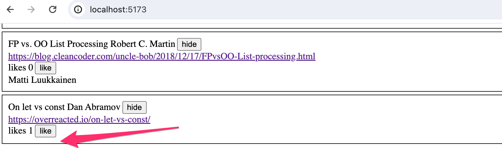

<div class="content">

### Displaying the login form only when appropriate

<!-- Let's modify the application so that the login form is not displayed by default:-->
让我们修改应用程序，使登录表单默认不显示：


<!-- The login form appears when the user presses the <i>login</i> button:-->
当用户按下<i>登录</i>按钮时，登录表单出现：


<!-- The user can close the login form by clicking the <i>cancel</i> button.-->
用户可以通过点击<i>取消</i>按钮关闭登录表单。

<!-- Let's start by extracting the login form into its own component:-->
让我们从把登录表单提取到它自己的组件开始：

```js
const LoginForm = ({
   handleSubmit,
   handleUsernameChange,
   handlePasswordChange,
   username,
   password
  }) => {
  return (
    <div>
      <h2>Login</h2>

      <form onSubmit={handleSubmit}>
        <div>
          username
          <input
            value={username}
            onChange={handleUsernameChange}
          />
        </div>
        <div>
          password
          <input
            type="password"
            value={password}
            onChange={handlePasswordChange}
          />
      </div>
        <button type="submit">login</button>
      </form>
    </div>
  )
}

export default LoginForm
```

<!-- The state and all the functions related to it are defined outside of the component and are passed to the component as props.-->
状态以及与之相关的所有功能都定义在组件之外，并作为props传递给组件。

<!-- Notice that the props are assigned to variables through <i>destructuring</i>, which means that instead of writing:-->
注意，通过<i>解构</i>将props分配给变量，这意味着而不是写：

```js
const LoginForm = (props) => {
  return (
    <div>
      <h2>Login</h2>
      <form onSubmit={props.handleSubmit}>
        <div>
          username
          <input
            value={props.username}
            onChange={props.handleChange}
            name="username"
          />
        </div>
        // ...
        <button type="submit">login</button>
      </form>
    </div>
  )
}
```

<!-- where the properties of the _props_ object are accessed through e.g. _props.handleSubmit_, the properties are assigned directly to their own variables.-->
在通过例如`props.handleSubmit`访问`props`对象的属性时，这些属性将直接分配到它们自己的变量中。

<!-- One fast way of implementing the functionality is to change the _loginForm_ function of the <i>App</i> component like so:-->
一个快速实现功能的方法是改变<i>App</i>组件的_loginForm_函数，如下：

```js
const App = () => {
  const [loginVisible, setLoginVisible] = useState(false) // highlight-line

  // ...

  const loginForm = () => {
    const hideWhenVisible = { display: loginVisible ? 'none' : '' }
    const showWhenVisible = { display: loginVisible ? '' : 'none' }

    return (
      <div>
        <div style={hideWhenVisible}>
          <button onClick={() => setLoginVisible(true)}>log in</button>
        </div>
        <div style={showWhenVisible}>
          <LoginForm
            username={username}
            password={password}
            handleUsernameChange={({ target }) => setUsername(target.value)}
            handlePasswordChange={({ target }) => setPassword(target.value)}
            handleSubmit={handleLogin}
          />
          <button onClick={() => setLoginVisible(false)}>cancel</button>
        </div>
      </div>
    )
  }

  // ...
}
```

<!-- The <i>App</i> components state now contains the boolean <i>loginVisible</i>, which defines if the login form should be shown to the user or not.-->
<i>App</i> 组件的状态现在包含布尔值 <i>loginVisible</i>，它定义是否应该向用户显示登录表单。

<!-- The value of _loginVisible_ is toggled with two buttons. Both buttons have their event handlers defined directly in the component:-->
`_loginVisible_` 的值由两个按钮切换。两个按钮的事件处理程序都直接定义在组件中：

```js
<button onClick={() => setLoginVisible(true)}>log in</button>

<button onClick={() => setLoginVisible(false)}>cancel</button>
```

<!-- The visibility of the component is defined by giving the component an [inline](/en/part2/adding_styles_to_react_app#inline-styles) style rule, where the value of the [display](https://developer.mozilla.org/en-US/docs/Web/CSS/display) property is <i>none</i> if we do not want the component to be displayed:-->
给组件定义[内联](/en/part2/adding_styles_to_react_app#inline-styles)样式规则可以定义组件的可见性，如果我们不想显示组件，[display](https://developer.mozilla.org/en-US/docs/Web/CSS/display)属性的值为<i>none</i>：

```js
const hideWhenVisible = { display: loginVisible ? 'none' : '' }
const showWhenVisible = { display: loginVisible ? '' : 'none' }

<div style={hideWhenVisible}>
  // button
</div>

<div style={showWhenVisible}>
  // button
</div>
```

<!-- We are once again using the "question mark" ternary operator. If _loginVisible_ is <i>true</i>, then the CSS rule of the component will be:-->
如果_loginVisible_是<i>true</i>，我们再次使用“问号”三元运算符，组件的CSS规则将是：

```css
display: 'none';
```

<!-- If _loginVisible_ is <i>false</i>, then <i>display</i> will not receive any value related to the visibility of the component.-->
如果_loginVisible_是<i>假</i>，那么<i>display</i>将不会收到任何与组件可见性相关的值。

### The components children, aka. props.children

<!-- The code related to managing the visibility of the login form could be considered to be its own logical entity, and for this reason, it would be good to extract it from the <i>App</i> component into a separate component.-->
考虑到与管理登录表单可见性相关的代码可以被认为是其自身的逻辑实体，因此，最好将其从<i>App</i>组件中提取到一个单独的组件中。

<!-- Our goal is to implement a new <i>Togglable</i> component that can be used in the following way:-->
我们的目标是实现一个新的<i>可切换</i>组件，可以以下面的方式使用：

```js
<Togglable buttonLabel='login'>
  <LoginForm
    username={username}
    password={password}
    handleUsernameChange={({ target }) => setUsername(target.value)}
    handlePasswordChange={({ target }) => setPassword(target.value)}
    handleSubmit={handleLogin}
  />
</Togglable>
```

<!-- The way that the component is used is slightly different from our previous components. The component has both opening and closing tags that surround a <i>LoginForm</i> component. In React terminology <i>LoginForm</i> is a child component of <i>Togglable</i>.-->
方式使用组件略有不同于我们以前的组件。组件有开放标签和关闭标签围绕着一个<i>LoginForm</i>组件。在React术语中<i>LoginForm</i>是<i>Togglable</i>的子组件。

<!-- We can add any React elements we want between the opening and closing tags of <i>Togglable</i>, like this for example:-->
<i>Togglable</i> 之间我们可以添加任何React元素，比如：

```js
<Togglable buttonLabel="reveal">
  <p>this line is at start hidden</p>
  <p>also this is hidden</p>
</Togglable>
```

<!-- The code for the <i>Togglable</i> component is shown below:-->
以下是<i>可切换</i>组件的代码：

```js
import { useState } from 'react'

const Togglable = (props) => {
  const [visible, setVisible] = useState(false)

  const hideWhenVisible = { display: visible ? 'none' : '' }
  const showWhenVisible = { display: visible ? '' : 'none' }

  const toggleVisibility = () => {
    setVisible(!visible)
  }

  return (
    <div>
      <div style={hideWhenVisible}>
        <button onClick={toggleVisibility}>{props.buttonLabel}</button>
      </div>
      <div style={showWhenVisible}>
        {props.children}
        <button onClick={toggleVisibility}>cancel</button>
      </div>
    </div>
  )
}

export default Togglable
```

<!-- The new and interesting part of the code is [props.children](https://reactjs.org/docs/glossary.html#propschildren), which is used for referencing the child components of the component. The child components are the React elements that we define between the opening and closing tags of a component.-->
新且有趣的代码部分是[props.children](https://reactjs.org/docs/glossary.html#propschildren)，它被用于引用组件的子组件。子组件就是我们在组件的开放和闭合标签之间定义的React元素。

<!-- This time the children are rendered in the code that is used for rendering the component itself:-->
这次，孩子们在用于渲染组件本身的代码中呈现：

```js
<div style={showWhenVisible}>
  {props.children}
  <button onClick={toggleVisibility}>cancel</button>
</div>
```

<!-- Unlike the "normal" props we''ve seen before, <i>children</i> is automatically added by React and always exists. If a component is defined with an automatically closing _/>_ tag, like this:-->
与我们以前见过的“正常”props不同，<i>children</i>是由React自动添加的，总是存在的。如果一个组件是用一个自动关闭的_/>_标签定义的，就像这样：

```js
<Note
  key={note.id}
  note={note}
  toggleImportance={() => toggleImportanceOf(note.id)}
/>
```

<!-- Then <i>props.children</i> is an empty array.-->
那么<i>props.children</i>就是一个空数组。

<!-- The <i>Togglable</i> component is reusable and we can use it to add similar visibility toggling functionality to the form that is used for creating new notes.-->
<i>可切换</i>组件是可复用的，我们可以使用它来为用于创建新笔记的表单添加类似的可见性切换功能。

<!-- Before we do that, let's extract the form for creating notes into a component:-->
在我们做之前，让我们把创建笔记的表单提取到一个组件中：

```js
const NoteForm = ({ onSubmit, handleChange, value}) => {
  return (
    <div>
      <h2>Create a new note</h2>

      <form onSubmit={onSubmit}>
        <input
          value={value}
          onChange={handleChange}
        />
        <button type="submit">save</button>
      </form>
    </div>
  )
}
```

<!-- Next let's define the form component inside of a <i>Togglable</i> component:-->
接下来，让我们来定义<i>可切换</i>组件内部的表单组件：

```js
<Togglable buttonLabel="new note">
  <NoteForm
    onSubmit={addNote}
    value={newNote}
    handleChange={handleNoteChange}
  />
</Togglable>
```

<!-- You can find the code for our current application in its entirety in the <i>part5-4</i> branch of [this GitHub repository](https://github.com/fullstack-hy2020/part2-notes/tree/part5-4).-->
你可以在[这个GitHub仓库](https://github.com/fullstack-hy2020/part2-notes/tree/part5-4)的<i>part5-4</i>分支找到我们当前应用的完整代码。

### State of the forms

<!-- The state of the application currently is in the _App_ component.-->
目前应用程序的状态位于_App_组件中。

<!-- React documentation says the [following](https://reactjs.org/docs/lifting-state-up.html) about where to place the state:-->
 React 文档对放置状态的位置进行了[如下](https://zh-hans.react.dev/learn/sharing-state-between-components)说明：

<!-- <i>Often, several components need to reflect the same changing data. We recommend lifting the shared state up to their closest common ancestor.</i> -->
> <i>有时，您希望两个组件的状态始终一起更改。要做到这一点，请从它们中删除状态，将其移动到它们最近的公共父级，然后通过 props 将其传递给它们。这被称为提升状态，这是你编写 React 代码时最常做的事情之一。</i>

<!-- If we think about the state of the forms, so for example the contents of a new note before it has been created, the _App_ component does not need it for anything.-->
如果我们考虑表单的状态，比如一个新笔记内容在它被创建之前，_App_ 组件不需要它。
<!-- We could just as well move the state of the forms to the corresponding components.-->
我们也可以把表单的状态移到相应的组件上。

<!-- The component for a note changes like so:-->
一个笔记的组件是这样变化的：

```js
import { useState } from 'react'

const NoteForm = ({ createNote }) => {
  const [newNote, setNewNote] = useState('')

  const addNote = (event) => {
    event.preventDefault()
    createNote({
      content: newNote,
      important: true
    })

    setNewNote('')
  }

  return (
    <div>
      <h2>Create a new note</h2>

      <form onSubmit={addNote}>
        <input
          value={newNote}
          onChange={event => setNewNote(event.target.value)}
        />
        <button type="submit">save</button>
      </form>
    </div>
  )
}

export default NoteForm
```

<!-- **NOTE** At the same time, we changed the behavior of the application so that new notes are important by default, i.e. the field <i>important</i> gets the value <i>true</i>. -->
**注意** 同时，我们改变了应用的行为，使得新的笔记默认为重要，也就是说，<i>important</i> 字段获得的值为 <i>true</i>。

<!-- The <i>newNote</i> state variable and the event handler responsible for changing it have been moved from the _App_ component to the component responsible for the note form. -->
<i>newNote</i> 状态变量和负责改变它的事件处理器已经从 _App_ 组件移动到负责笔记表单的组件。

<!-- There is only one prop left, the _createNote_ function, which the form calls when a new note is created. -->
现在只剩下一个 prop，即 _createNote_ 函数，当创建新的笔记时，表单会调用它。

<!-- The _App_ component becomes simpler now that we have got rid of the <i>newNote</i> state and its event handler. -->
<!-- The _addNote_ function for creating new notes receives a new note as a parameter, and the function is the only prop we send to the form: -->
_App_ 组件现在变得更简单，因为我们已经摆脱了 <i>newNote</i> 状态和它的事件处理器。
创建新笔记的 _addNote_ 函数接收一个新的笔记作为参数，函数是我们发送给表单的唯一 prop：

```js
const App = () => {
  // ...
  const addNote = (noteObject) => { // highlight-line
    noteService
      .create(noteObject)
      .then(returnedNote => {
        setNotes(notes.concat(returnedNote))
      })
  }
  // ...
  const noteForm = () => (
    <Togglable buttonLabel='new note'>
      <NoteForm createNote={addNote} />
    </Togglable>
  )

  // ...
}
```

<!-- We could do the same for the log in form, but we'll leave that for an optional exercise. -->
我们可以对登录表单做同样的事情，但我们将把这留作可选的练习。

<!-- The application code can be found on [GitHub](https://github.com/fullstack-hy2020/part2-notes-frontend/tree/part5-5), branch <i>part5-5</i>. -->
应用程序代码可以在 [GitHub](https://github.com/fullstack-hy2020/part2-notes-frontend/tree/part5-5) 上找到，分支为 <i>part5-5</i>。

### References to components with ref

<!-- Our current implementation is quite good, it has one aspect that could be improved.-->
我们目前的实现相当不错，但它有一个可以改进的方面。

<!-- After a new note is created, it would make sense to hide the new note form. Currently, the form stays visible. There is a slight problem with hiding the form. The visibility is controlled with the <i>visible</i> state variable inside of the <i>Togglable</i> component.  -->
创建新的笔记后，隐藏新的笔记表单是有意义的。目前，表单仍然可见。隐藏表单有一个小问题。可见性是由 <i>Togglable</i> 组件内部的 <i>visible</i> 状态变量控制的。

<!-- One solution to this would be to move control of the Togglable component's state outside the component. However, we won't do that now, because we want the component to be responsible for its own state. So we have to find another solution, and find a mechanism to change the state of the component externally. -->
解决这个问题的一个办法是将 Togglable 组件的状态控制移出组件。然而，我们现在不会这样做，因为我们希望组件负责自己的状态。所以我们必须找到另一种解决方案，并找到一种机制来从外部改变组件的状态。

<!-- There are several different ways to implement access to a component's functions from outside the component, but let's use the [ref](https://react.dev/learn/referencing-values-with-refs) mechanism of React, which offers a reference to the component. -->
有几种不同的方法可以实现从组件外部访问组件的函数，但让我们使用 React 的 [ref](https://react.dev/learn/referencing-values-with-refs) 机制，它提供了对组件的引用。

<!-- Let's make the following changes to the <i>App</i> component:-->
让我们对<i>App</i>组件做出以下更改：

```js
import { useState, useEffect, useRef } from 'react' // highlight-line

const App = () => {
  // ...
  const noteFormRef = useRef() // highlight-line

  const noteForm = () => (
    <Togglable buttonLabel='new note' ref={noteFormRef}>  // highlight-line
      <NoteForm createNote={addNote} />
    </Togglable>
  )

  // ...
}
```

<!-- The [useRef](https://reactjs.org/docs/hooks-reference.html#useref) hook is used to create a <i>noteFormRef</i> ref, that is assigned to the <i>Togglable</i> component containing the creation note form. The <i>noteFormRef</i> variable acts as a reference to the component. This hook ensures the same reference (ref) that is kept throughout re-renders of the component.-->
[useRef](https://reactjs.org/docs/hooks-reference.html#useref) 钩子用于创建一个<i>noteFormRef</i> ref，该ref被分配给包含创建笔记表单的<i>Togglable</i>组件。<i>noteFormRef</i>变量充当组件的引用。此钩子确保在组件重新渲染期间保持相同的引用（ref）。

<!-- We also make the following changes to the <i>Togglable</i> component:-->
我们也对<i>可切换</i>组件做出了以下更改：

```js
import { useState, forwardRef, useImperativeHandle } from 'react' // highlight-line

const Togglable = forwardRef((props, refs) => { // highlight-line
  const [visible, setVisible] = useState(false)

  const hideWhenVisible = { display: visible ? 'none' : '' }
  const showWhenVisible = { display: visible ? '' : 'none' }

  const toggleVisibility = () => {
    setVisible(!visible)
  }

// highlight-start
  useImperativeHandle(refs, () => {
    return {
      toggleVisibility
    }
  })
// highlight-end

  return (
    <div>
      <div style={hideWhenVisible}>
        <button onClick={toggleVisibility}>{props.buttonLabel}</button>
      </div>
      <div style={showWhenVisible}>
        {props.children}
        <button onClick={toggleVisibility}>cancel</button>
      </div>
    </div>
  )
})  // highlight-line

export default Togglable
```

<!-- The function that creates the component is wrapped inside of a [forwardRef](https://reactjs.org/docs/react-api.html#reactforwardref) function call. This way the component can access the ref that is assigned to it.-->
[forwardRef](https://reactjs.org/docs/react-api.html#reactforwardref)函数调用中封装了创建组件的函数。 这样，组件就可以访问分配给它的引用。

<!-- The component uses the [useImperativeHandle](https://reactjs.org/docs/hooks-reference.html#useimperativehandle) hook to make its <i>toggleVisibility</i> function available outside of the component.-->
组件使用[useImperativeHandle](https://reactjs.org/docs/hooks-reference.html#useimperativehandle)钩子来使其<i>toggleVisibility</i>函数在组件之外可用。

<!-- We can now hide the form by calling <i>noteFormRef.current.toggleVisibility()</i> after a new note has been created:-->
我们现在可以在新建笔记后呼叫<i>noteFormRef.current.toggleVisibility()</i> 来隐藏表单。

```js
const App = () => {
  // ...
  const addNote = (noteObject) => {
    noteFormRef.current.toggleVisibility() // highlight-line
    noteService
      .create(noteObject)
      .then(returnedNote => {
        setNotes(notes.concat(returnedNote))
      })
  }
  // ...
}
```

<!-- To recap, the [useImperativeHandle](https://reactjs.org/docs/hooks-reference.html#useimperativehandle) function is a React hook, that is used for defining functions in a component, which can be invoked from outside of the component.-->
总结一下，[useImperativeHandle](https://reactjs.org/docs/hooks-reference.html#useimperativehandle)函数是一个React hook，用于在组件中定义可以从组件外部调用的函数。

<!-- This trick works for changing the state of a component, but it looks a bit unpleasant. We could have accomplished the same functionality with slightly cleaner code using "old React" class-based components. We will take a look at these class components during part 7 of the course material. So far this is the only situation where using React hooks leads to code that is not cleaner than with class components.-->
这个技巧可以改变组件的状态，但看起来有点不太好。我们可以用“旧的React”基于类的组件用稍微更清晰的代码实现同样的功能。我们将在课程材料的第7章节讨论这些类组件。到目前为止，这是使用React钩子导致代码不比类组件更清洁的唯一情况。

<!-- There are also [other use cases](https://reactjs.org/docs/refs-and-the-dom.html) for refs than accessing React components.-->
也有[其他用例](https://reactjs.org/docs/refs-and-the-dom.html) 不仅仅是用于访问 React 组件的 refs。

<!-- You can find the code for our current application in its entirety in the <i>part5-6</i> branch of [this GitHub repository](https://github.com/fullstack-hy2020/part2-notes/tree/part5-6).-->
您可以在[此GitHub存储库](https://github.com/fullstack-hy2020/part2-notes/tree/part5-6)的<i>part5-6</i>分支中找到我们当前应用程序的完整代码。

### One point about components

<!-- When we define a component in React:-->
当我们在React中定义一个组件时：

```js
const Togglable = () => ...
  // ...
}
```

<!-- And use it like this:-->
# 像这样使用它

使用它就像这样：

```js
<div>
  <Togglable buttonLabel="1" ref={togglable1}>
    first
  </Togglable>

  <Togglable buttonLabel="2" ref={togglable2}>
    second
  </Togglable>

  <Togglable buttonLabel="3" ref={togglable3}>
    third
  </Togglable>
</div>
```

<!-- We create <i>three separate instances of the component</i> that all have their separate state:-->
我们创建<i>三个独立的组件实例</i>，它们都有自己的状态：


<!-- The <i>ref</i> attribute is used for assigning a reference to each of the components in the variables <i>togglable1</i>, <i>togglable2</i> and <i>togglable3</i>.-->
<i>ref</i>属性用于为变量<i>togglable1</i>、<i>togglable2</i>和<i>togglable3</i>中的每个组件分配引用。

### The updated full stack developer's oath

<!-- The number of moving parts increases. At the same time, the likelihood of ending up in a situation where we are looking for a bug in the wrong place increases. So we need to be even more systematic.-->
随着零件数量的增加，最终陷入在错误的地方寻找 bug 的情况的可能性也会增加。因此我们需要更加系统地处理。

<!-- So we should once more extend our oath:-->
我们应该再次宣誓：

<!-- Full stack development is <i> extremely hard</i>, that is why I will use all the possible means to make it easier-->
全栈开发<i>非常困难</i>，所以我会尽可能多的手段来让它变得更容易。

<!-- - I will have my browser developer console open all the time-->
我会一直开著浏览器开发者控制台。
<!-- - I will use the network tab of the browser dev tools to ensure that frontend and backend are communicating as I expect-->
我将使用浏览器开发工具的网络选项卡来确保前端和后端按照我的预期进行通信。
<!-- - I will constantly keep an eye on the state of the server to make sure that the data sent there by the frontend is saved there as I expect-->
我会不断关注服务器的状态，以确保前端发送到那里的数据按我的期望保存在那里。
<!-- - I will keep an eye on the database: does the backend save data there in the right format-->
?

我会留意数据库：后端会把数据以正确的格式保存在那里吗？
<!-- - I progress with small steps-->
我一步一步地进步。
<!-- - <i>when I suspect that there is a bug in the frontend, I make sure that the backend works for sure</i>-->
当我怀疑前端存在bug时，我确保后端一定能工作。
<!-- - <i>when I suspect that there is a bug in the backend, I make sure that the frontend works for sure</i>-->
当我怀疑后端有 bug 时，我确保前端一定能够正常工作。
<!-- - I will write lots of _console.log_ statements to make sure I understand how the code and the tests behave and to help pinpoint problems-->
我会写很多`console.log`语句，以确保我理解代码和测试的行为，并帮助确定问题。
<!-- - If my code does not work, I will not write more code. Instead, I start deleting the code until it works or just return to a state when everything still was still working-->
.

如果我的代码不起作用，我不会再写更多的代码。相反，我会开始删除代码，直到它可以工作，或者只是返回到一个所有事情都仍然正常工作的状态。
<!-- - If a test does not pass, I make sure that the tested functionality for sure works in the application-->
如果测试不通过，我确保应用程序中测试的功能确实有效。
<!-- - When I ask for help in the course Discord or Telegram channel or elsewhere I formulate my questions properly, see [here](https://fullstackopen.com/en/part0/general_info#how-to-get-help-in-discord-telegram) how to ask for help-->
当我在课程Discord或Telegram频道或其他地方寻求帮助时，我会正确地提出问题，[参见此处](https://fullstackopen.com/en/part0/general_info#how-to-get-help-in-discord-telegram)如何寻求帮助。

</div>

<div class="tasks">

### Exercises 5.5.-5.11.

#### 5.5 Blog list frontend, step5

<!-- Change the form for creating blog posts so that it is only displayed when appropriate. Use functionality similar to what was shown [earlier in this part of the course material](/en/part5/props_children_and_proptypes#displaying-the-login-form-only-when-appropriate). If you wish to do so, you can use the <i>Togglable</i> component defined in part 5.-->
改变创建博客文章的表单，以便仅在适当的情况下才显示。使用与本课程材料[早些时候展示的](/en/part5/props_children_and_proptypes#displaying-the-login-form-only-when-appropriate)功能类似的功能。如果您愿意，可以使用第5章节定义的<i>Togglable</i>组件。

<!-- By default the form is not visible-->
默认情况下，表格不可见


<!-- It expands when button <i>create new blog</i> is clicked-->
当点击<i>创建新博客</i>按钮时，它就会展开。


<!-- The form closes when a new blog is created.-->
表格在新的博客创建时关闭。

#### 5.6 Blog list frontend, step6

<!-- Separate the form for creating a new blog into its own component (if you have not already done so), and move all the states required for creating a new blog to this component.-->
将创建新博客的表格单独拆分为一个组件（如果尚未这样做），并将所有用于创建新博客的状态移动到此组件中。

<!-- The component must work like the <i>NoteForm</i> component from the [material](/en/part5/props_children_and_proptypes) of this part.-->
该组件必须像本部分[材料](/en/part5/props_children_and_proptypes)中的<i>NoteForm</i>组件一样工作。

#### 5.7 Blog list frontend, step7

<!-- Let's add a button to each blog, which controls whether all of the details about the blog are shown or not.-->
让我们为每个博客添加一个按钮，用来控制是否显示所有关于博客的细节。

<!-- Full details of the blog open when the button is clicked.-->
当按钮被点击时，博客的全部细节将会开放。


<!-- And the details are hidden when the button is clicked again.-->
而当按钮再次被点击时，细节被隐藏。

<!-- At this point, the <i>like</i> button does not need to do anything.-->
在这一点上，<i>喜欢</i>按钮不需要做任何事情。

<!-- The application shown in the picture has a bit of additional CSS to improve its appearance.-->
图片中展示的应用程序有一些额外的CSS来改善它的外观。

<!-- It is easy to add styles to the application as shown in part 2 using [inline](/en/part2/adding_styles_to_react_app#inline-styles) styles:-->
它很容易像部分2中使用[内联](/en/part2/adding_styles_to_react_app#inline-styles)样式为应用添加样式：

```js
const Blog = ({ blog }) => {
  const blogStyle = {
    paddingTop: 10,
    paddingLeft: 2,
    border: 'solid',
    borderWidth: 1,
    marginBottom: 5
  }

  return (
    <div style={blogStyle}> // highlight-line
      <div>
        {blog.title} {blog.author}
      </div>
      // ...
  </div>
)}
```

<!-- **NB:** even though the functionality implemented in this part is almost identical to the functionality provided by the <i>Togglable</i> component, the component can not be used directly to achieve the desired behavior. The easiest solution will be to add a state to the blog post that controls the displayed form of the blog post.-->
**翻译：**尽管本部分实现的功能几乎与<i>Togglable</i>组件提供的功能相同，但该组件不能直接用于实现所需的行为。最简单的解决方案是在博客文章中添加一个控制博客文章显示形式的状态。

#### 5.8: Blog list frontend, step8

<!-- Implement the functionality for the like button. Likes are increased by making an HTTP _PUT_ request to the unique address of the blog post in the backend.-->
 实现喜欢按钮的功能。通过向后端的博文的唯一地址发出HTTP _PUT_请求来增加赞。


<!-- When the browser is reloaded, the information of the person is displayed. This is not acceptable, find out where the problem is and make the necessary correction.-->
当浏览器重新加载时，个人信息会显示出来，这是不可接受的，找出问题所在并进行必要的修正。

#### 5.9: Blog list frontend, step9

<!-- Implement the functionality for the like button. Likes are increased by making an HTTP _PUT_ request to the unique address of the blog post in the backend.-->
实现点赞按钮的功能。可以通过向后端博客文章的唯一地址发出HTTP _PUT_ 请求来增加点赞数。

<!-- Since the backend operation replaces the entire blog post, you will have to send all of its fields in the request body. If you wanted to add a like to the following blog post:-->
由于后端操作替换了整个博客文章，您必须在请求体中发送所有字段。如果您想在以下博客文章中添加一个喜欢：

```js
{
  _id: "5a43fde2cbd20b12a2c34e91",
  user: {
    _id: "5a43e6b6c37f3d065eaaa581",
    username: "mluukkai",
    name: "Matti Luukkainen"
  },
  likes: 0,
  author: "Joel Spolsky",
  title: "The Joel Test: 12 Steps to Better Code",
  url: "https://www.joelonsoftware.com/2000/08/09/the-joel-test-12-steps-to-better-code/"
},
```

<!-- You would have to make an HTTP PUT request to the address <i>/api/blogs/5a43fde2cbd20b12a2c34e91</i> with the following request data:-->
你必须发送一个HTTP PUT 请求到地址<i>/api/blogs/5a43fde2cbd20b12a2c34e91</i>，带上以下请求数据：

```js
{
  user: "5a43e6b6c37f3d065eaaa581",
  likes: 1,
  author: "Joel Spolsky",
  title: "The Joel Test: 12 Steps to Better Code",
  url: "https://www.joelonsoftware.com/2000/08/09/the-joel-test-12-steps-to-better-code/"
}
```

<!-- The backend has to be updated too to handle the user reference.-->
后端也必须更新以处理用户参考。

<!-- **One last warning:** if you notice that you are using async/await and the _then_-method in the same code, it is almost certain that you are doing something wrong. Stick to using one or the other, and never use both at the same time "just in case".-->
 **最后一个警告：**如果你注意到你在同一段代码中使用async/await和_then_方法，几乎可以肯定你做错了什么。坚持使用其中一个，而不要同时使用两个，"以防万一"。

#### 5.9: Blog List Frontend, step 9

<!-- We notice that something is wrong. When a blog is liked in the app, the name of the user that added the blog is not shown in its details: -->
我们注意到有些地方出问题了。当在应用中喜欢一篇博客时，添加该博客的用户的名字并未显示在其详细信息中：



<!-- When the browser is reloaded, the information of the person is displayed. This is not acceptable, find out where the problem is and make the necessary correction. -->
当浏览器刷新时，人物的信息就显示出来了。这是不可接受的，找出问题所在并做出必要的修正。

<!-- Of course, it is possible that you have already done everything correctly and the problem does not occur in your code. In that case, you can move on. -->
当然，也有可能你已经做得一切都正确，问题并没有出现在你的代码中。在那种情况下，你可以继续前进。

#### 5.10: Blog List Frontend, step 10

<!-- Modify the application to sort the blog posts by the number of <i>likes</i>. The Sorting can be done with the array [sort](https://developer.mozilla.org/en-US/docs/Web/JavaScript/Reference/Global_Objects/Array/sort) method. -->
修改应用程序，按照 <i>likes</i> 的数量对博客帖子进行排序。排序可以使用数组的 [sort](https://developer.mozilla.org/zh-CN/docs/Web/JavaScript/Reference/Global_Objects/Array/sort) 方法。

#### 5.11: Blog List Frontend, step 11

<!-- Add a new button for deleting blog posts. Also, implement the logic for deleting blog posts in the frontend. -->
添加一个新的按钮用于删除博客帖子。同时，在前端实现删除博客帖子的逻辑。

<!-- Your application could look something like this: -->
你的应用程序可能看起来像这样：


<!-- The confirmation dialog for deleting a blog post is easy to implement with the [window.confirm](https://developer.mozilla.org/en-US/docs/Web/API/Window/confirm) function. -->
使用 [window.confirm](https://developer.mozilla.org/zh-CN/docs/Web/API/Window/confirm) 函数，实现删除博客帖子的确认对话框非常简单。

<!-- Show the button for deleting a blog post only if the blog post was added by the user. -->
只有当博客帖子是由用户添加的时候，才显示删除博客帖子的按钮。

</div>

<div class="content">

### PropTypes

<!-- The <i>Togglable</i> component assumes that it is given the text for the button via the <i>buttonLabel</i> prop. If we forget to define it to the component:-->
<i>Togglable</i> 组件假设通过<i>buttonLabel</i> prop 给出按钮的文本。如果我们忘记将它定义给组件：

```js
<Togglable> buttonLabel forgotten... </Togglable>
```

<!-- The application works, but the browser renders a button that has no label text.-->
应用程序可以正常工作，但是浏览器渲染出来的按钮没有文本标签。

<!-- We would like to enforce that when the <i>Togglable</i> component is used, the button label text prop must be given a value.-->
我们希望强制要求，当使用<i>可切换</i>组件时，按钮标签文本prop必须被赋值。

<!-- The expected and required props of a component can be defined with the [prop-types](https://github.com/facebook/prop-types) package. Let's install the package:-->
[prop-types](https://github.com/facebook/prop-types) 包可以用来定义组件的预期和必需的 props。让我们来安装该包：

```shell
npm install prop-types
```

<!-- We can define the <i>buttonLabel</i> prop as a mandatory or <i>required</i> string-type prop as shown below:-->
我们可以将<i>buttonLabel</i> prop定义为强制性或<i>required</i>的字符串类型prop，如下所示：

```js
import PropTypes from 'prop-types'

const Togglable = React.forwardRef((props, ref) => {
  // ..
})

Togglable.propTypes = {
  buttonLabel: PropTypes.string.isRequired
}
```

<!-- The console will display the following error message if the prop is left undefined:-->
控制台如果prop未定义，将显示以下错误消息：


<!-- The application still works and nothing forces us to define props despite the PropTypes definitions. Mind you, it is extremely unprofessional to leave <i>any</i> red output to the browser console.-->
 尽管有PropTypes的定义，应用仍然可以工作，没有任何东西强迫我们定义prop。请注意，给浏览器控制台留下<i>任何</i>红色输出是非常不专业的。

<!-- Let's also define PropTypes to the <i>LoginForm</i> component:-->
也让我们为 <i>LoginForm</i> 组件定义 PropTypes：

```js
import PropTypes from 'prop-types'

const LoginForm = ({
   handleSubmit,
   handleUsernameChange,
   handlePasswordChange,
   username,
   password
  }) => {
    // ...
  }

LoginForm.propTypes = {
  handleSubmit: PropTypes.func.isRequired,
  handleUsernameChange: PropTypes.func.isRequired,
  handlePasswordChange: PropTypes.func.isRequired,
  username: PropTypes.string.isRequired,
  password: PropTypes.string.isRequired
}
```

<!-- If the type of a passed prop is wrong, e.g. if we try to define the <i>handleSubmit</i> prop as a string, then this will result in the following warning:-->
如果传递的prop类型错误，例如我们试图将<i>handleSubmit</i> prop定义为字符串，那么这将导致以下警告：


### ESlint

<!-- In part 3 we configured the [ESlint](/en/part3/validation_and_es_lint#lint) code style tool to the backend. Let's take ESlint to use in the frontend as well.-->
 在第三章节，我们将[ESlint](/zh/part3/es_lint与代码检查#lint)代码风格工具配置到后端。让我们把ESlint也用在前端。

<!-- Vite has installed ESlint to the project by default, so all that's left for us to do is define our desired configuration in the <i>.eslintrc.cjs</i> file. -->
Vite 默认将 ESlint 安装到项目中，所以我们剩下要做的就是在 .eslintrc.cjs 文件中定义我们想要的配置。

<!-- Let's create a <i>.eslintrc.cjs</i> file with the following contents: -->
让我们创建一个包含以下内容的 .eslintrc.cjs 文件：
```bash
npm install --save-dev eslint-plugin-jest
```

<!-- Let's create a <i>.eslintrc.js</i> file with the following contents:-->
让我们创建一个<i>.eslintrc.js</i>文件，内容如下：

```js
module.exports = {
  root: true,
  env: {
    browser: true,
    es2020: true,
  },
  extends: [
    'eslint:recommended',
    'plugin:react/recommended',
    'plugin:react/jsx-runtime',
    'plugin:react-hooks/recommended',
  ],
  ignorePatterns: ['dist', '.eslintrc.cjs'],
  parserOptions: { ecmaVersion: 'latest', sourceType: 'module' },
  settings: { react: { version: '18.2' } },
  plugins: ['react-refresh'],
  rules: {
    "indent": [
        "error",
        2  
    ],
    "linebreak-style": [
        "error",
        "unix"
    ],
    "quotes": [
        "error",
        "single"
    ],
    "semi": [
        "error",
        "never"
    ],
    "eqeqeq": "error",
    "no-trailing-spaces": "error",
    "object-curly-spacing": [
        "error", "always"
    ],
    "arrow-spacing": [
        "error", { "before": true, "after": true }
    ],
    "no-console": 0,
    "react/react-in-jsx-scope": "off",
    "react/prop-types": 0,
    "no-unused-vars": 0    
  },
}
```

<!-- NOTE: If you are using Visual Studio Code together with ESLint plugin, you might need to add a workspace setting for it to work. If you are seeing ```Failed to load plugin react: Cannot find module 'eslint-plugin-react'``` additional configuration is needed. Adding the line ```"eslint.workingDirectories": [{ "mode": "auto" }]``` to settings.json in the workspace seems to work. See [here](https://github.com/microsoft/vscode-eslint/issues/880#issuecomment-578052807) for more information.-->
如果您使用Visual Studio Code配合ESLint插件，您可能需要添加一个工作区设置才能让它正常工作。如果您看到```Failed to load plugin react: Cannot find module 'eslint-plugin-react'```，则需要额外的配置。将行```"eslint.workingDirectories": [{ "mode": "auto" }]```添加到工作区中的settings.json似乎可以正常工作。有关更多信息，请参见[这里](https://github.com/microsoft/vscode-eslint/issues/880#issuecomment-578052807)。

<!-- Let's create [.eslintignore](https://eslint.org/docs/user-guide/configuring#ignoring-files-and-directories) file with the following contents to the repository root-->
让我们在存储库根目录创建[.eslintignore](https://eslint.org/docs/user-guide/configuring#ignoring-files-and-directories)文件，其内容如下：

```bash
node_modules
dist
.eslintrc.cjs
vite.config.js
```

<!-- Now the directories <em>build</em> and <em>node_modules</em> will be skipped when linting.-->
现在当进行linting时，<em>build</em>和<em>node_modules</em>这两个目录将被跳过。

<!-- Let us also create an npm script to run the lint:-->
让我们也创建一个npm脚本来运行lint：

```js
{
  // ...
  {
    "scripts": {
    "start": "react-scripts start",
    "build": "react-scripts build",
    "test": "react-scripts test",
    "eject": "react-scripts eject",
    "eslint": "eslint ." // highlight-line
  },
  // ...
}
```

<!-- Component _Togglable_ causes a nasty-looking warning <i>Component definition is missing display name</i>:-->
组件_Togglable_引发一个难看的警告<i>组件定义缺少显示名称</i>：


<!-- The react-devtools also reveals that the component does not have a name:-->
React-devtools 也揭示了组件没有名字：


<!-- Fortunately, this is easy to fix-->
.

幸运的是，这很容易修复。

```js
import { useState, useImperativeHandle } from 'react'
import PropTypes from 'prop-types'

const Togglable = React.forwardRef((props, ref) => {
  // ...
})

Togglable.displayName = 'Togglable' // highlight-line

export default Togglable
```

<!-- You can find the code for our current application in its entirety in the <i>part5-7</i> branch of [this GitHub repository](https://github.com/fullstack-hy2020/part2-notes/tree/part5-7).-->
你可以在[这个GitHub仓库](https://github.com/fullstack-hy2020/part2-notes/tree/part5-7)的<i>part5-7</i>分支找到我们当前应用的完整代码。

</div>

<div class="tasks">

### Exercise 5.12.

#### 5.12: Blog List Frontend, step 12

<!-- Define PropTypes for one of the components of your application, and add ESlint to the project. Define the configuration according to your liking. Fix all of the linter errors. -->
为你的应用程序的一个组件定义 PropTypes，并将 ESlint 添加到项目中。根据你的喜好定义配置。修复所有的 linter 错误。

<!-- Vite has installed ESlint to the project by default, so all that's left for you to do is define your desired configuration in the <i>.eslintrc.cjs</i> file. -->
Vite 已经默认在项目中安装了 ESlint，所以你需要做的就是在 <i>.eslintrc.cjs</i> 文件中定义你想要的配置。

</div>
